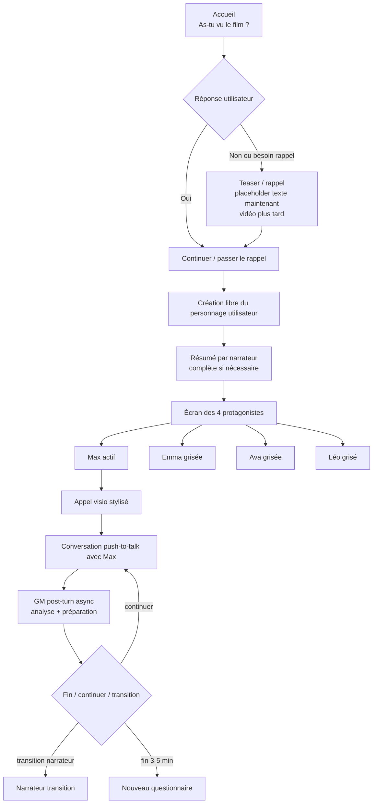
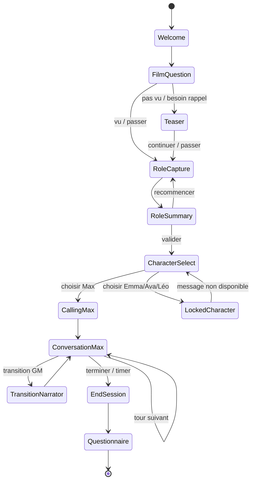

# PRD 4 prototype mai 2026

État: Généré
Catégorie: Prototype
Dernière modification: 22 mai 2026 15:03
Date de création: 22 mai 2026 09:03
Créé par: Ulrich Fischer

**PRD 4 — Prototype AVA mai 2026**

Refonte structurante du début de l’expérience AVA dans Lovable : remplacement de la mécanique A/B actuelle par un onboarding unique post-film, création libre du personnage utilisateur, écran des 4 protagonistes, Max seul actif au démarrage, push-to-talk, Game Master post-turn asynchrone et nouveau questionnaire.

<br />

***

## 1. Résumé exécutif

Ce PRD définit la mise à jour profonde du prototype AVA actuellement développé dans Lovable.

L’objectif n’est pas de faire un patch rapide de l’onboarding existant, mais de restructurer le début de l’expérience pour l’aligner avec la nouvelle intention produit :

> Après le film, l’expérience ne consiste pas à “trouver Ava”, mais à entrer dans le storyworld et à dialoguer avec ses personnages.

Le prototype doit permettre à l’utilisateur de :

1. comprendre ou se remémorer le contexte du film via un teaser / rappel skippable ;
2. inventer librement son propre rôle dans le monde fictionnel ;
3. voir les 4 protagonistes — Max, Emma, Ava, Léo — dans une interface de type appel visio stylisé ;
4. appeler Max, seul personnage actif au démarrage ;
5. converser avec Max en push-to-talk, avec affichage des paroles utilisateur et personnage ;
6. terminer une session courte de 3 à 5 minutes ;
7. répondre à un nouveau questionnaire entièrement adapté à cette mécanique.

Le prototype doit conserver les forces existantes :

* stockage des conversations en base de données ;

* back-office Lovable / Supabase existant ;

* pipeline vocal STT → LLM → TTS ;

* Game Master ;

* RAG / contexte narratif ;

* dashboard d’administration.

Mais il doit modifier la structure d’entrée, la mécanique d’usage, les données stockées et le questionnaire.

***

## 2. contexte

### État actuel du prototype

Le prototype existant valide déjà une boucle technique importante :

* React + Vite + Tailwind + TypeScript via Lovable ;

* Supabase / Lovable Cloud ;

* Deepgram pour STT ;

* OpenRouter pour LLM ;

* ElevenLabs pour TTS ;

* Notion → Supabase → embeddings pour le RAG ;

* back-office `/admin` ;

* conversations stockées ;

* Game Master existant ;

* Max comme personnage conversationnel principal.

La mise à jour PRD4 ne doit pas casser ces acquis. Elle doit les réorganiser autour d’une expérience plus claire, plus cinématographique et plus testable.

***

## 3. Objectif produit

### Objectif principal

Remplacer la mécanique actuelle d’onboarding A/B par une expérience d’entrée unique, robuste et cinématographique, pensée pour une situation post-film / sortie de salle.

### Formulation cible

> Le film s’est terminé, mais la relation au monde fictionnel continue. L’utilisateur devient un personnage du storyworld et appelle Max pour parler avec lui.

### Ce que le prototype doit tester

* Est-ce que l’utilisateur comprend qu’il doit inventer un rôle ?

* Est-ce que le rôle créé influence la conversation avec Max ?

* Est-ce que le push-to-talk est clair et fluide ?

* Est-ce que l’écran des 4 protagonistes donne envie d’appeler les autres ?

* Est-ce que Max semble crédible comme personnage et non comme assistant IA ?

* Est-ce qu’une session courte de 3 à 5 minutes suffit à créer une envie de continuer ?

* Est-ce que le rappel / teaser aide les personnes qui n’ont pas vu le film ou qui ont besoin d’un contexte ?

***

## 4. Décisions produit validées

| Point                     | Décision                                                                                                                                     |
| ------------------------- | -------------------------------------------------------------------------------------------------------------------------------------------- |
| 4 personnages             | Les 4 personnages doivent être visibles : Max, Emma, Ava, Léo. Seul Max est actif au démarrage. Emma, Ava et Léo sont grisées / non actives. |
| Images personnages        | Lovable doit prévoir des placeholders temporaires. Les images finales seront fournies plus tard.                                             |
| Intro / teaser            | À terme : vraie vidéo. Pour maintenant : placeholder texte à l’écran avec mention que la séquence sera remplacée par une vidéo.              |
| Texte teaser              | Utiliser le texte exact de la voix off Romed.                                                                                                |
| Film vu / pas vu          | Garder la question “As-tu vu le film ?”. Proposer le teaser aux personnes qui ne l’ont pas vu ou veulent un rappel. Possibilité de skipper.  |
| Rôle utilisateur          | Libre. Pas de rôles prédéfinis cliquables. Proposer seulement 3 exemples pour inspirer.                                                      |
| Complétion du rôle        | Suivre la proposition Romed : si l’utilisateur ne répond pas à tout, le système complète le profil comme il le juge pertinent.               |
| Stockage rôle utilisateur | Ajouter un champ JSON dans la table de session existante. Pas de nouvelle table dédiée pour le moment.                                       |
| Persistance               | La conversation et le personnage créé sont stockés en base / back-office, mais pas de persistance entre sessions pour l’utilisateur.         |
| Modalité voix             | Démarrer avec push-to-talk. L’UI doit onboarding clairement ce mode d’usage.                                                                 |
| Sous-titres / transcript  | Toujours afficher les paroles STT de l’utilisateur et les paroles TTS du personnage.                                                         |
| Interface conversation    | Écran cinéma stylisé avec éléments d’interface visio.                                                                                        |
| Narrateur                 | Le narrateur guide l’entrée et revient pour les transitions. Les transitions exactes seront précisées plus tard.                             |
| Game Master               | Pas de pre-turn pour le moment. Garder un GM post-turn asynchrone pour préserver latence minimale et fluidité maximale.                      |
| Objectif narratif         | Expérience ouverte : il ne s’agit pas de trouver Ava, mais de dialoguer avec les personnages.                                                |
| Durée cible               | Session courte de 3 à 5 minutes.                                                                                                             |
| Questionnaire             | Remplacer totalement l’ancien questionnaire. Le nouveau doit être adapté au PRD4 dans Lovable et dans la base Questionnaire AVA.             |

***

## 5. Parcours utilisateur cible



***

## 6. State machine cible



### Phases techniques proposées

```tsx
type ExperiencePhase =
  | "welcome"
  | "film_question"
  | "teaser"
  | "role_capture"
  | "role_summary"
  | "character_select"
  | "locked_character"
  | "calling_max"
  | "conversation_max"
  | "transition_narrator"
  | "end_session"
  | "questionnaire";
```

***

## 7. Écran par écran

### 7.1 Écran 1 — Accueil

**But** : poser immédiatement le cadre cinéma / post-film.

Contenu :

* Titre : `Où est Ava ?`

* Sous-titre : `Après le film, les personnages peuvent encore te parler.`

* Texte court :

  * `Cette expérience te propose d’entrer dans le monde du film et d’appeler ses protagonistes.`

* CTA principal :

  * `Commencer`

Direction visuelle :

* fond sombre ;

* ambiance cinéma ;

* typographie sobre ;

* pas de look “jeu vidéo” trop explicite ;

* pas de look “assistant IA”.

### 7.2 Écran 2 — Question “As-tu vu le film ?”

**But** : adapter l’entrée sans bloquer.

Question :

> As-tu vu le film *Où est Ava ?*

Options :

* `Oui`

* `Non`

* `Il y a longtemps / j’ai besoin d’un rappel`

Comportement :

* `Oui` → proposer de passer directement à la création du personnage, avec option “voir le rappel quand même”.

* `Non` ou `Il y a longtemps` → proposer le teaser / rappel.

* L’utilisateur doit toujours pouvoir skipper le rappel.

### 7.3 Écran 3 — Teaser / rappel placeholder

**But** : donner le contexte narratif minimal.

État actuel :

* pas encore de vraie vidéo ;

* afficher le texte exact de la voix off Romed ;

* ajouter une mention visible :

  * `Placeholder : cette séquence sera remplacée par une vidéo d’introduction.`

Boutons :

* `Passer`

* `Continuer`

### 7.4 Texte exact à afficher pour le teaser

> Bienvenue dans l'expérience interactive du film \*\*\*\**Où est Ava ?*
> Le film suit une famille ordinaire — Max, Emma, et leurs deux enfants Ava et Léo — qui se réfugie dans un chalet d'alpage pour fuir une pandémie hors du commun : un virus qui transforme les femmes en hommes. Un phénomène que l'on appelle la protogynie.
> Face à l'inconnu, Max et Emma tentent de protéger ce qu'ils ont — leur famille, leur équilibre, leur identité. Mais cette peur de perdre, imperceptiblement, les transforme. Les vieilles structures du patriarcat refont surface. L'inhumain s'installe sans qu'on le voie vraiment venir.
> Ava et Léo, eux, semblent regarder le monde autrement. Une lueur fragile — peut-être la seule.
> Le séjour à la montagne s'est achevé dans l'horreur. Plusieurs morts. Et un retour en ville chargé de silence. Emma et Ava sont désormais contaminées. Dans quelques jours, elles deviendront à leur tour des protogynes.

Note implementation :

* Le texte doit être repris tel quel.

* Si Lovable ou l’UI impose un format plus lisible, conserver le texte exact, mais l’afficher en paragraphes / sous-titres.

* Ne pas réécrire le contenu sans validation.

### 7.5 Écran 4 — Création du personnage utilisateur

**But** : transformer l’utilisateur de spectateur en personnage du storyworld.

Texte narrateur à utiliser comme base :

> À toi de jouer.
> Tu vas pouvoir t'entretenir par visioconférence avec l'un ou l’autre des membres de la famille. Mais pour entrer dans leur monde, tu dois d'abord exister dans le leur.
> Qui es-tu ? Une amie d'Ava ? Un collègue de travail de Max? Un voisin ? Un psychologue mandaté par les autorités ? Un journaliste ? Chacun sera accueilli différemment selon ce qu'il représente — la proximité, la menace, ou l'espoir.
> Avant de choisir avec qui tu souhaites parler, présente le personnage que tu souhaites incarner en quelques phrases. N'oublie pas de préciser son genre et son âge — dans ce monde-là, ça compte.
> On t’écoute.

Instructions écran :

* Afficher clairement :

  * `Qui es-tu ?`

  * `Quelle est ta relation avec Max, Emma, Léo et Ava ?`

  * `Quel est ton genre ?`

  * `Quel est ton âge ?`

  * `Pourquoi appelles-tu maintenant ?`

* Proposer 3 exemples textuels, non cliquables :

  1. `Tu pourrais être une amie d’Ava qui cherche à comprendre ce qui s’est passé.`
  2. `Tu pourrais être un psychologue mandaté par les autorités.`
  3. `Tu pourrais être un voisin qui connaît la famille de loin.`

* Ne pas proposer de rôles prédéfinis cliquables.

* L’utilisateur doit parler librement.

### 7.6 Push-to-talk pour création du personnage

Comme la modalité choisie est push-to-talk, l’écran doit expliquer clairement :

* `Maintiens le bouton appuyé pour parler.`

* `Relâche quand tu as terminé.`

* `Tu peux recommencer si nécessaire.`

Composants :

* gros bouton central ;

* état visuel `Appuie pour parler` ;

* état visuel `Je t’écoute…` pendant l’appui ;

* transcription en direct ou après relâchement ;

* bouton `Valider mon personnage`.

### 7.7 Écran 5 — Résumé du personnage utilisateur

**But** : confirmer que le système a bien compris / généré le rôle.

Comportement :

* Le système produit un résumé à partir de la réponse utilisateur.

* Si des informations manquent, le système complète selon la proposition Romed.

* Le résumé est affiché à l’utilisateur.

Exemple :

> Je résume : Tu es la meilleure amie d’Emma et tu connais également les autres membres de la famille. Tu es une femme d’une cinquantaine d’année. Et tu n’es pas protogyne.

Boutons :

* `Continuer`

* `Recommencer`

À stocker :

* input brut ;

* résumé visible utilisateur ;

* résumé interne pour Max / GM ;

* champs structurés dans `user_role_profile_json`.

### 7.8 Écran 6 — Choix du protagoniste

**But** : faire sentir que le monde contient 4 personnages, même si Max seul est actif.

UI :

* 4 vignettes :

  * Max : actif ;

  * Emma : grisée / bientôt disponible ;

  * Ava : grisée / bientôt disponible ;

  * Léo : grisé / bientôt disponible.

* Lovable doit utiliser des placeholders pour les images.

* Les images finales seront fournies plus tard.

* Les cartes grisées doivent être visibles mais non cliquables ou cliquer doit afficher un message explicatif.

Texte narrateur :

> À qui veux-tu parler ?

Comportement :

* Si utilisateur choisit Max → lancer appel.

* Si utilisateur choisit Emma/Ava/Léo → afficher :

  * `Ce personnage n’est pas encore disponible dans cette version du prototype.`

  * `Pour l’instant, tu peux appeler Max.`

* Il ne faut pas masquer les autres personnages, car leur présence est une promesse importante de l’expérience future.

### 7.9 Écran 7 — Appel Max

**But** : rendre l’entrée en conversation cinématographique.

UI :

* vignette Max s’agrandit ;

* sonnerie / animation d’appel ;

* éléments d’interface visio stylisée ;

* bouton `Raccrocher` optionnel ;

* micro inactif pendant la sonnerie.

Texte d’aide :

> Max va décrocher. Quand ce sera à toi de parler, maintiens le bouton appuyé.

Après 2–3 sonneries :

* Max décroche ;

* première réponse de Max doit tenir compte du rôle utilisateur si possible.

### 7.10 Écran 8 — Conversation avec Max

**But** : conversation voice-to-voice fluide, courte, crédible.

UI :

* Max au centre ;

* style cinéma / visio ;

* sous-titres Max ;

* transcript utilisateur ;

* bouton push-to-talk principal ;

* bouton `Terminer` ;

* timer discret ;

* pas de score de confiance visible ;

* pas d’interface “jeu” trop explicite.

Affichage obligatoire :

* paroles utilisateur STT ;

* paroles Max TTS ;

* état de traitement :

  * `Max réfléchit…`

  * `Max répond…`

  * `À toi de parler`

Push-to-talk :

* L’utilisateur maintient pour parler ;

* relâche pour envoyer ;

* Max répond ensuite ;

* éviter micro ouvert dans cette version.

### 7.11 Écran 9 — Fin / questionnaire

La session cible dure 3 à 5 minutes.

Déclencheurs de fin possibles :

* utilisateur clique `Terminer` ;

* timer atteint ;

* GM recommande une transition de fin ;

* comportement utilisateur hors-jeu répété ;

* erreur technique.

Fin narrative recommandée :

* éviter un “game over” brutal ;

* utiliser un texte sobre :

  * `La communication se coupe.`

  * `Max reste silencieux un instant.`

  * `L’expérience s’arrête ici pour cette version du prototype.`

Puis questionnaire.

***

## 8. Mécanique push-to-talk

### Objectif

Le push-to-talk est choisi pour cette version afin de :

* réduire les ambiguïtés micro ;

* éviter les interruptions involontaires ;

* améliorer le contrôle utilisateur ;

* faciliter la compréhension du tour de parole.

### UX obligatoire

L’UI doit onboarder explicitement :

1. appuyer pour parler ;
2. maintenir pendant toute la phrase ;
3. relâcher quand terminé ;
4. attendre la réponse de Max.

### Microcopy recommandée

* état idle : `Maintiens pour parler`

* état recording : `Je t’écoute… relâche quand tu as fini`

* état sending : `Message envoyé`

* état Max thinking : `Max réfléchit…`

* état Max speaking : `Max répond…`

* erreur si phrase vide : `Je n’ai rien entendu. Réessaie en maintenant le bouton.`

### Critère d’acceptation

Un utilisateur novice doit comprendre le push-to-talk en moins de 10 secondes sans instruction orale supplémentaire.

***

## 9. Données à stocker en base

### Principe

La conversation est déjà stockée en base de données et visible dans le back-office. PRD4 doit ajouter le personnage créé par l’utilisateur à la session existante.

### Décision technique

Ajouter un champ JSON à la table de session existante.

Nom recommandé :

```tsx
user_role_profile_json
```

### Structure JSON cible

```json
{
  "raw_input": "",
  "summary_for_user": "",
  "summary_for_max": "",
  "relationship_to_family": "",
  "age": "",
  "gender": "",
  "proximity_level": "",
  "intent": "",
  "created_by_system": true,
  "created_at": ""
}
```

### Définition des champs

* `raw_input` : transcription brute de la présentation utilisateur.

* `summary_for_user` : résumé affiché à l’utilisateur.

* `summary_for_max` : version concise injectée dans le contexte de Max.

* `relationship_to_family` : relation déclarée ou inférée.

* `age` : âge déclaré ou inféré.

* `gender` : genre déclaré ou inféré.

* `proximity_level` : proximité avec la famille.

* `intent` : pourquoi la personne appelle.

* `created_by_system` : true si le système a complété des informations.

* `created_at` : timestamp.

### Valeurs possibles pour `proximity_level`

```tsx
type ProximityLevel =
  | "proche"
  | "connu"
  | "institutionnel"
  | "inconnu"
  | "menaçant";
```

### Back-office

Le back-office doit permettre de voir :

* le rôle brut ;

* le résumé ;

* les champs structurés ;

* la session liée ;

* la conversation liée.

***

## 10. Game Master PRD4

### 10.1 Principe

Le Game Master reste centralisé pour l’instant.

Il ne doit pas être placé dans le chemin critique avant chaque réponse de Max. La priorité est :

* latence minimale ;

* réactivité ;

* fluidité ;

* expérience vocale naturelle.

### 10.2 Version à implémenter maintenant

**GM post-turn asynchrone**

Après chaque échange, le GM analyse :

* le message utilisateur ;

* la réponse de Max ;

* le rôle utilisateur ;

* la durée de session ;

* les thèmes abordés ;

* les signes d’intérêt / confusion ;

* les opportunités de transition future ;

* les moments où une cinématique pourrait être insérée plus tard.

Le GM prépare des recommandations pour les tours suivants, mais ne bloque pas la génération actuelle de Max.

### 10.3 Ce que le GM doit produire

Format JSON recommandé :

```json
{
  "engagement_delta": 1,
  "confusion_detected": false,
  "role_usage_quality": "good",
  "topics_covered": ["famille", "contamination"],
  "transition_recommended": false,
  "transition_type": null,
  "cinematic_hint": null,
  "next_turn_guidance": "Max peut reconnaître davantage la proximité émotionnelle de l'utilisateur.",
  "end_recommended": false,
  "moderation_flag": false,
  "notes": "L'utilisateur joue le rôle de manière cohérente."
}
```

### 10.4 Rôle du GM dans les transitions

Le GM doit à terme gérer :

* le passage entre personnages ;

* l’insertion de cinématiques ;

* les transitions du narrateur ;

* les recommandations de rythme ;

* les recadrages si Max devient trop assistant IA ou trop explicatif.

Mais pour cette version :

* les autres personnages ne sont pas actifs ;

* les cinématiques ne sont pas encore pleinement implémentées ;

* le GM doit seulement préparer / logger les indices utiles.

### 10.5 Pas de pre-turn pour le moment

Ne pas implémenter de GM pre-turn obligatoire dans PRD4.

Raison :

* chaque appel LLM supplémentaire dans le chemin critique ajoute de la latence ;

* l’objectif prioritaire est la fluidité ;

* le post-turn asynchrone permet de garder un Max réactif tout en observant la qualité.

### 10.6 Alternative future — GM centralisé vs GM séparé

Le PRD doit préparer la décision future.

#### Option A — GM centralisé

Avantages :

* plus simple ;

* moins de latence ;

* plus facile à debugger ;

* cohérent tant que Max seul est actif ;

* moins coûteux en appels LLM.

Inconvénients :

* prompt plus large ;

* risque de mélange entre onboarding, gameplay, transitions et analyse ;

* moins modulaire quand les 4 personnages seront actifs.

#### Option B — GM séparé par fonction

Exemples :

* Onboarding GM ;

* Transition GM ;

* Conversation GM ;

* Cinematic GM ;

* Memory GM.

Avantages :

* prompts spécialisés ;

* meilleur contrôle éditorial ;

* plus simple à tester fonction par fonction ;

* plus adapté à une expérience multi-personnages.

Inconvénients :

* plus d’appels LLM ;

* plus de latence ;

* plus de complexité ;

* plus de risques de désynchronisation.

Recommandation PRD4 :

> Rester centralisé maintenant, mais structurer les noms, les outputs JSON et le code pour permettre un split plus tard.

***

## 11. Mémoire inter-personnages — options futures

Comme seul Max est actif dans PRD4, la mémoire inter-personnages n’est pas à implémenter maintenant. Mais le PRD doit poser les implications.

### Option A — Mémoire commune de session

Tout ce que l’utilisateur dit à Max est disponible pour les futurs personnages.

Avantages :

* continuité forte ;

* impression d’un monde cohérent ;

* Emma/Ava/Léo peuvent réagir à ce qui a déjà été dit.

Inconvénients :

* risque narratif : comment les personnages savent-ils ce qui a été dit à Max ?

* besoin d’explication fictionnelle ou de restriction.

### Option B — Mémoire filtrée par personnage

Chaque personnage ne connaît que ce qu’il peut plausiblement savoir.

Avantages :

* meilleure cohérence fictionnelle ;

* plus de tension dramatique ;

* secrets mieux protégés.

Inconvénients :

* plus complexe techniquement ;

* nécessite un GM / Context Manager plus robuste ;

* nécessite des règles de visibilité par personnage.

Recommandation future :

> Utiliser une mémoire commune technique, mais filtrée narrativement avant injection dans chaque personnage.

***

## 12. Gameplay PRD4

### 12.1 Principe

L’expérience est ouverte. Elle ne doit pas être formulée comme une enquête classique où l’objectif serait “trouver Ava”.

Le gameplay repose plutôt sur :

* la relation ;

* la posture de l’utilisateur ;

* la crédibilité du rôle ;

* le dialogue ;

* la tension émotionnelle ;

* l’envie d’appeler les autres personnages.

### 12.2 Ce qui ne doit pas être visible dans l’interface utilisateur

Ne pas afficher :

* score de confiance ;

* niveau ;

* quête ;

* objectif de type “trouver Ava” ;

* arbre de dialogue ;

* indicateur technique de GM.

### 12.3 Ce qui doit être ressenti

L’utilisateur doit sentir :

* qu’il a un rôle dans le monde ;

* que Max répond différemment selon ce rôle ;

* que les autres personnages existent ;

* que la conversation pourrait continuer ;

* que le monde fictionnel dépasse la session actuelle.

### 12.4 Timer

Durée cible :

* 3 à 5 minutes.

Le timer peut être :

* invisible ;

* discret ;

* uniquement utilisé côté système.

Recommandation :

* ne pas afficher un compte à rebours stressant ;

* utiliser une fin douce au bout du temps cible.

***

## 13. Spécification technique Lovable

### 13.1 À modifier dans l’application

Lovable doit :

1. supprimer / remplacer l’ancien onboarding A/B ;
2. créer le nouveau flow d’entrée ;
3. ajouter la question “As-tu vu le film ?” ;
4. ajouter l’écran teaser texte ;
5. ajouter l’écran création du rôle utilisateur ;
6. ajouter le résumé de rôle ;
7. ajouter l’écran 4 personnages ;
8. griser Emma/Ava/Léo ;
9. rendre Max actif ;
10. adapter la conversation à push-to-talk ;
11. afficher STT utilisateur et TTS Max ;
12. stocker `user_role_profile_json` dans la session ;
13. adapter le GM post-turn ;
14. remplacer totalement le questionnaire.

### 13.2 À préserver

Ne pas casser :

* stockage conversation existant ;

* back-office sessions ;

* pipeline STT ;

* pipeline TTS ;

* Max agent ;

* RAG existant ;

* suivi de sessions ;

* dashboard admin.

### 13.3 Robustesse

Le PRD4 est une refonte structurante. Il faut éviter les hacks fragiles.

Exigences :

* composants séparés par écran / phase ;

* state machine claire ;

* session object propre ;

* erreurs micro gérées ;

* fallback si STT vide ;

* fallback si résumé rôle échoue ;

* placeholders personnages propres ;

* questionnaire indépendant de l’ancien A/B.

### 13.4 Performance / latence

Objectif prioritaire : réactivité maximale.

Exigences :

* pas de GM pre-turn bloquant ;

* push-to-talk rapide ;

* feedback visuel immédiat ;

* affichage des transcripts sans attendre la fin de toute la chaîne ;

* GM post-turn asynchrone ;

* ne pas multiplier les appels LLM inutiles.

***

## 14. Nouveau questionnaire PRD4

### 14.1 Principe

L’ancien questionnaire doit être totalement remplacé.

Le nouveau questionnaire doit mesurer :

1. contexte film / teaser ;
2. création du rôle ;
3. clarté du push-to-talk ;
4. crédibilité de Max ;
5. envie d’appeler les autres personnages ;
6. durée 3–5 min ;
7. friction / rupture d’immersion.

### 14.2 Questions utilisateur recommandées

Limiter à environ 10 questions pour éviter fatigue.

#### Q1 — Film

**Question** : Avais-tu vu le film avant l’expérience ?

Type : select

Options :

* Oui

* Non

#### Q2 — Teaser

**Question** : Le rappel / teaser t’a-t-il aidé à entrer dans l’histoire ?

Type : score 1–5

Condition : affichée si teaser vu.

#### Q3 — Rôle

**Question** : As-tu compris quel rôle tu devais inventer ?

Type : score 1–5

#### Q4 — Résumé

**Question** : Le résumé de ton personnage était-il juste ?

Type : score 1–5

#### Q5 — Push-to-talk

**Question** : Le push-to-talk était-il clair à utiliser ?

Type : score 1–5

#### Q6 — Max et rôle

**Question** : As-tu eu l’impression que Max tenait compte de ton rôle ?

Type : score 1–5

#### Q7 — Crédibilité Max

**Question** : Max t’a-t-il semblé crédible comme personnage ?

Type : score 1–5

#### Q8 — Autres personnages

**Question** : As-tu eu envie d’appeler Emma, Ava ou Léo ?

Type : score 1–5

Question complémentaire :

**Qui aurais-tu voulu appeler ensuite ?**

Options :

* Emma

* Ava

* Léo

* Max encore

* Aucun

#### Q9 — Durée

**Question** : Comment as-tu ressenti la durée de l’expérience ?

Options :

* Trop court

* Juste

* Trop long

#### Q10 — Feedback ouvert

**Question** : Qu’est-ce qui t’a le plus marqué ou sorti de l’expérience ?

Type : texte long.

#### Contact optionnel — email

**Question** : Souhaites-tu laisser ton email ?

Type : email

Texte d’aide :

* `Laisse ton email si tu veux être tenu·e au courant du projet ou si tu acceptes d’être contacté·e pour un feedback plus détaillé.`

Cases à cocher :

* `Je souhaite être tenu·e au courant du projet.`

* `J’accepte d’être contacté·e pour un feedback plus détaillé.`

### 14.3 Données techniques à envoyer automatiquement

Sans demander à l’utilisateur :

* Session ID ;

* date soumission ;

* durée réelle ;

* teaser vu / skippé ;

* rôle utilisateur JSON ;

* personnage actif ;

* nombre de tours ;

* latence moyenne ;

* latence max ;

* nombre d’erreurs push-to-talk ;

* durée totale parole utilisateur ;

* durée totale parole Max ;

* transcript disponible oui/non.

* email contact ;

* opt-in être tenu au courant du projet ;

* opt-in contact feedback plus détaillé.

### 14.4 Mise à jour de la base Questionnaire AVA

Dans , ajouter ou mapper les champs PRD4 suivants.

Champs recommandés :

* `PRD4 A vu le film` — select

* `PRD4 Teaser vu` — checkbox

* `PRD4 Teaser utile score` — number

* `PRD4 Role creation clarte` — number

* `PRD4 Role summary justesse` — number

* `PRD4 PTT clarte` — number

* `PRD4 PTT frustration` — number

* `PRD4 Max reconnait role` — number

* `PRD4 Max credible personnage` — number

* `PRD4 Envie autres personnages` — number

* `PRD4 Personnage souhaite prochain` — select

* `PRD4 Duree ressentie` — select

* `PRD4 Rupture immersion` — text

* `PRD4 Role JSON` — text ou rich text si nécessaire

* `PRD4 Teaser skippé` — checkbox

* `PRD4 Nb tours` — number

* `PRD4 Latence moyenne ms` — number

* `PRD4 Latence max ms` — number

* `PRD4 Erreurs PTT` — number

* `PRD4 Email contact` — email

* `PRD4 Être tenu au courant` — checkbox

* `PRD4 Contact feedback détaillé` — checkbox

Important :

* remplacer l’ancien questionnaire côté Lovable ;

* ne pas continuer à alimenter les champs A/B ;

* conserver les anciennes données historiques en base, mais ne plus les utiliser dans la nouvelle app.

***

## 15. Critères d’acceptation

### 15.1 Onboarding

* [ ] &#x20;L’utilisateur voit la question “As-tu vu le film ?”.

* [ ] &#x20;L’utilisateur peut voir le teaser / rappel ou le skipper.

* [ ] &#x20;Le texte exact Romed est affiché dans le placeholder teaser.

* [ ] &#x20;Une mention indique que le placeholder sera remplacé par une vidéo.

* [ ] &#x20;L’utilisateur comprend qu’il doit inventer un rôle libre.

* [ ] &#x20;Trois exemples non cliquables sont affichés.

* [ ] &#x20;Le rôle est résumé par le système.

* [ ] &#x20;Le système complète les informations manquantes si nécessaire.

### 15.2 Personnages

* [ ] &#x20;Les 4 personnages sont visibles.

* [ ] &#x20;Max est actif.

* [ ] &#x20;Emma, Ava et Léo sont grisées / non actives.

* [ ] &#x20;Les images utilisent des placeholders.

* [ ] &#x20;Cliquer sur un personnage non actif affiche un message clair.

* [ ] &#x20;Lovable permet de remplacer les placeholders par des images finales plus tard.

### 15.3 Conversation

* [ ] &#x20;La conversation avec Max utilise push-to-talk.

* [ ] &#x20;L’UI explique clairement comment utiliser push-to-talk.

* [ ] &#x20;Les paroles utilisateur sont affichées.

* [ ] &#x20;Les paroles Max sont affichées.

* [ ] &#x20;Le style visuel est cinéma + visio.

* [ ] &#x20;La session peut se terminer en 3 à 5 minutes.

* [ ] &#x20;Pas de score de confiance visible.

### 15.4 Stockage

*  [ ] Le champ `user_role_profile_json` est ajouté à la session existante.

* [ ] &#x20;Le rôle brut est stocké.

* [ ] &#x20;Le résumé utilisateur est stocké.

* [ ] &#x20;Le résumé pour Max est stocké.

* [ ] &#x20;Les champs structurés sont stockés.

* [ ] &#x20;Les données sont visibles dans le back-office.

### 15.5 Game Master

* [ ] &#x20;Le GM reste post-turn asynchrone.

* [ ] &#x20;Le GM ne bloque pas la réponse de Max.

* [ ] &#x20;Le GM produit une analyse structurée après les tours.

* [ ] &#x20;Le GM peut préparer des recommandations de transition.

* [ ] &#x20;Pas de pre-turn obligatoire dans cette version.

### 15.6 Questionnaire

* [ ] &#x20;L’ancien questionnaire est remplacé totalement.

* [ ] &#x20;Le nouveau questionnaire mesure teaser, rôle, PTT, Max, autres personnages, durée, immersion.

* [ ] &#x20;Les données techniques automatiques sont envoyées.

* [ ] &#x20;Les nouveaux champs PRD4 sont mappés vers .

***

## 16. Checklist Lovable — prompt d’implémentation

### Prompt à donner à Lovable

Mettre à jour le prototype AVA en profondeur selon le PRD4.

Objectif : remplacer l’ancien onboarding A/B par un nouveau début unique post-film.

Implémenter :

1. Écran accueil.
2. Question “As-tu vu le film ?”.
3. Teaser / rappel placeholder avec texte exact fourni.
4. Mention que le teaser sera remplacé par une vidéo.
5. Création libre du personnage utilisateur.
6. Push-to-talk clairement expliqué.
7. Trois exemples non cliquables de rôles possibles.
8. Résumé du rôle utilisateur.
9. Stockage du rôle dans `user_role_profile_json` sur la session existante.
10. Écran des 4 protagonistes.
11. Max actif.
12. Emma, Ava, Léo grisées.
13. Placeholders images pour les 4 personnages.
14. Appel visio stylisé avec Max.
15. Conversation push-to-talk avec affichage STT/TTS.
16. GM post-turn asynchrone uniquement.
17. Session cible 3 à 5 minutes.
18. Nouveau questionnaire remplaçant totalement l’ancien.
19. Mapping du questionnaire vers la base Questionnaire AVA.
20. Préserver le stockage conversation et le back-office existants.

Priorités :

* robustesse ;

* architecture claire ;

* latence minimale ;

* fluidité ;

* pas de GM pre-turn bloquant ;

* pas de patch rapide fragile.

***

## 17. Risques

### Risque 1 — Confusion rôle utilisateur

Si l’utilisateur ne comprend pas qu’il doit inventer un personnage, l’expérience échoue dès le départ.

Mitigation :

* texte clair ;

* exemples ;

* push-to-talk bien expliqué ;

* résumé de rôle.

### Risque 2 — Frustration personnages grisés

Voir Emma/Ava/Léo mais ne pas pouvoir les appeler peut frustrer.

Mitigation :

* message clair : “disponible dans une prochaine version” ;

* Max actif mis en avant ;

* questionnaire mesure l’envie d’appeler les autres.

### Risque 3 — Push-to-talk mal compris

Si l’utilisateur relâche trop tôt ou oublie d’appuyer, la conversation casse.

Mitigation :

* UI très claire ;

* états visuels ;

* feedback si aucun son ;

* question questionnaire dédiée.

### Risque 4 — Max ignore le rôle utilisateur

Si Max répond de manière générique, l’onboarding perd son sens.

Mitigation :

* injecter `summary_for_max` dans le contexte ;

* mesurer `Max reconnait role` dans questionnaire ;

* back-office pour analyser les sessions.

### Risque 5 — Latence

Toute chaîne STT → LLM → TTS risque d’être lente.

Mitigation :

* pas de GM pre-turn ;

* GM post-turn async ;

* feedback visuel immédiat ;

* optimisation modèle / tokens.

### Risque 6 — Ancien questionnaire non supprimé

Si l’ancien questionnaire A/B continue à exister, les données deviennent confuses.

Mitigation :

* remplacement total côté Lovable ;

* nouveaux champs PRD4 ;

* anciennes données conservées seulement comme historique.

***

## 18. Roadmap après PRD4

### Étape suivante 1 — Activer Emma

* fiche personnage Emma ;

* prompt Emma ;

* voix ;

* règles de connaissance ;

* première mécanique de transition.

### Étape suivante 2 — Activer Ava / Léo

* déterminer si Ava est appelable directement ou doit rester plus mystérieuse ;

* définir disponibilité narrative de Léo ;

* créer prompts et voix.

### Étape suivante 3 — Cinématiques

* remplacer placeholder texte par vraie vidéo teaser ;

* définir moments d’insertion ;

* connecter GM à `cinematic_hint`.

### Étape suivante 4 — Mémoire inter-personnages

* décider mémoire commune vs mémoire filtrée ;

* ajouter règles de visibilité narrative ;

* préparer Context Manager.

### Étape suivante 5 — Game Master modulaire

* si nécessaire, splitter :

  * Onboarding GM ;

  * Transition GM ;

  * Conversation GM ;

  * Cinematic GM.

***

## 19. Décisions restantes à suivre

* Images finales des 4 personnages à fournir.

* Vidéo teaser finale à produire.

* Prompts Emma/Ava/Léo à écrire avant activation.

* Règles exactes du narrateur en transition à préciser.

* Mécaniques de cinématiques à détailler.

* Mémoire inter-personnages à trancher avant multi-personnages actifs.

***

## 20. Définition de “done”

Le PRD4 est considéré implémenté lorsque :

* l’ancien onboarding A/B n’est plus visible ;

* le nouveau flow complet fonctionne ;

* le rôle utilisateur est créé, résumé et stocké ;

* Max tient compte du rôle dans sa conversation ;

* les 4 personnages sont visibles ;

* Max seul est actif ;

* push-to-talk est clair et fonctionnel ;

* la session dure 3 à 5 minutes ;

* le GM reste post-turn asynchrone ;

* le nouveau questionnaire remplace l’ancien ;

* les données PRD4 apparaissent dans le back-office et dans Questionnaire AVA ;

* l’expérience est suffisamment robuste pour être testée avec des utilisateurs externes.