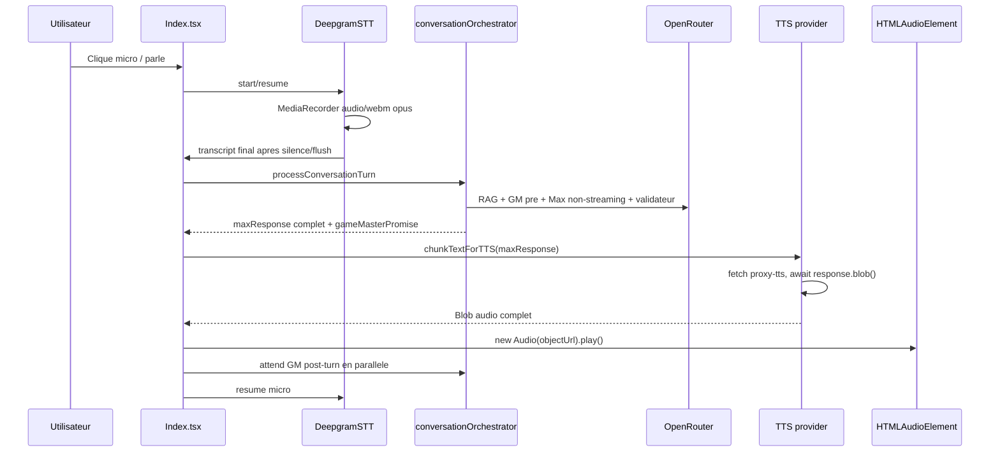
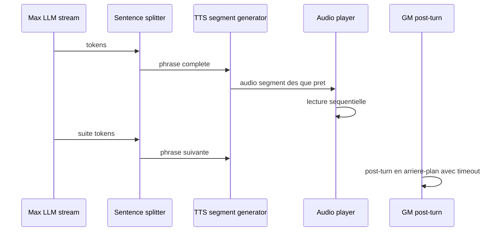

# Audit — Robustesse et latence du pipeline vocal Max

> Statut : audit technique et plan d'amélioration
> Date : 2026-05-22
> Périmètre : interaction conversationnelle voix entre l'utilisateur et l'avatar Max, incluant STT, orchestration LLM, TTS, lecture audio navigateur, états UI et télémétrie.

***

## 1. Résumé exécutif

Le pipeline vocal est fonctionnel en environnement favorable, mais il n'est pas encore robuste pour une utilisation multi-navigateurs réelle. Les problèmes observés sur Safari, Firefox, Brave et Chrome sont cohérents avec trois faiblesses structurelles :

1. **Capture micro trop dépendante de** **`MediaRecorder`** **WebM/Opus** : `DeepgramSTT` force `audio/webm;codecs=opus` sans feature detection ni fallback, ce qui casse ou fragilise Safari et certains environnements Firefox.
2. **Streaming TTS non exploité côté lecture** : le proxy ElevenLabs renvoie un flux, mais le front attend `response.blob()` complet avant de jouer l'audio. La latence de premier octet est mesurée, mais pas transformée en démarrage vocal perceptible.
3. **Machine d'état conversationnelle sans timeouts durs partout** : plusieurs appels réseau ou opérations audio peuvent rester pendants. Le verrou `isProcessingRef` reste actif jusqu'à la fin de la lecture TTS et du Game Master post-turn, ce qui peut donner l'impression que "plus rien ne se passe".

Conclusion : la priorité doit être la robustesse navigateur et la récupération d'erreur, puis l'optimisation de latence. Les deux peuvent avancer ensemble si l'on met en place un moteur audio central, des timeouts, un fallback STT WebAudio PCM, et un vrai pipeline progressif LLM -> TTS -> playback.

***

## 2. Architecture actuelle observée

### 2.1 Flux réel en production

Fichiers principaux :

* `src/pages/Index.tsx` : orchestration UI, micro, tour conversationnel, TTS queue, reprise micro.

* `src/services/deepgramSTT.ts` : token Deepgram, micro, WebSocket STT, silence timer.

* `src/services/conversationOrchestrator.ts` : RAG, GM pre-turn, Max, validateur, GM post-turn.

* `src/agents/maxAgent.ts` : prompt Max, appels LLM streaming ou non-streaming.

* `src/services/tts/` : facade multi-provider, queue, providers ElevenLabs/Inworld/Hume.

* `supabase/functions/proxy-stt/index.ts` : emission token Deepgram.

* `supabase/functions/proxy-tts/index.ts` : proxy ElevenLabs streaming.

* `supabase/functions/proxy-llm/index.ts` : proxy OpenRouter.

Flux actuel :



### 2.2 Ecart avec l'intention PRD

Le PRD et le README décrivent un pipeline "streaming" ou "sentence-level streaming" où Max commence à parler dès que possible. L'implémentation actuelle est plus bloquante :

* Max est généré via `simulateMaxResponse()`, donc texte complet avant TTS.

* Le TTS utilise l'endpoint streaming ElevenLabs côté proxy, mais le provider fait `await response.blob()`, donc lecture seulement après réception complète.

* Le chunking TTS ne s'applique qu'après obtention de la réponse Max complète.

* La validation anti-hallucination pré-TTS garantit la sécurité éditoriale, mais ajoute une étape bloquante avant toute voix.

Ce choix améliore la qualité et la sécurité, mais augmente fortement la latence perçue.

***

## 3. Constats critiques

### 3.1 STT : incompatibilité navigateur probable

Code actuel :

```ts
this.mediaRecorder = new MediaRecorder(this.stream, {
  mimeType: 'audio/webm;codecs=opus',
});
```

Risque :

* Safari ne garantit pas `audio/webm;codecs=opus` via `MediaRecorder`.

* Firefox et Chromium ont des matrices MIME différentes selon OS/version.

* Aucun `MediaRecorder.isTypeSupported()` n'est appelé.

* Aucun fallback `audio/mp4`, `audio/ogg`, format par défaut, ou WebAudio PCM.

* Si `MediaRecorder` échoue, l'utilisateur revient à `idle` sans diagnostic actionnable.

Impact :

* Safari : échec au démarrage micro ou absence de transcription.

* Firefox : comportement variable selon support du conteneur.

* Brave/Chrome : souvent OK, mais dépend des permissions, extensions privacy, profils et politiques audio.

### 3.2 STT : latence de fin de parole trop rigide

Code actuel :

```ts
private static SILENCE_DELAY_MS = 1500;
```

Risque :

* Le micro ouvert impose environ 1,5 seconde avant de finaliser une phrase.

* Cette fenêtre est stable mais ressentie comme lente.

* Deepgram est configuré avec `endpointing=false`; le code ignore donc les signaux serveur de fin de parole sauf transcription finale.

Impact :

* Latence minimale utilisateur -> Max augmente mécaniquement.

* Les utilisateurs ont l'impression que Max "réfléchit" avant même que le pipeline LLM commence.

### 3.3 TTS : streaming annulé par `response.blob()`

Code actuel :

```ts
const response = await fetch(`${SUPABASE_URL}/functions/v1/proxy-tts`, ...);
const tFirstByte = performance.now();
const blob = await response.blob();
```

Le proxy :

```ts
return new Response(response.body, {
  headers: { 'Content-Type': 'audio/mpeg', 'Transfer-Encoding': 'chunked' },
});
```

Risque :

* Le proxy reçoit et relaie un flux, mais le navigateur attend le blob complet.

* `t_tts_first_byte_ms` est une métrique réseau, pas le temps jusqu'au premier son.

* Pour des réponses de 300-700 caractères, le premier son arrive après toute la génération du blob.

Impact :

* Latence perçue TTS nettement supérieure à la latence first-byte.

* Les gains de l'endpoint streaming ElevenLabs sont peu exploités.

### 3.4 Lecture audio : autoplay et activation utilisateur

Code actuel :

```ts
const audio = new Audio(audioUrl);
audio.play().catch(reject);
```

Risque :

* Les politiques navigateur peuvent rejeter `play()` avec `NotAllowedError`.

* Le `play()` arrive longtemps après le geste utilisateur initial, après plusieurs awaits.

* Brave/Chrome peuvent bloquer selon configuration, engagement du site, iframe, préférences et protections.

* Le code ne distingue pas clairement `NotAllowedError`, format non supporté, decode error, réseau, quota provider.

Impact :

* "TTS ne fonctionne pas toujours" sur Chromium/Brave.

* L'app peut basculer en mode texte alors qu'un simple geste "Activer la voix" aurait suffi.

### 3.5 Blocage conversationnel : `Promise.all` trop central

Code actuel :

```ts
const [, gmResult] = await Promise.all([
  ttsQueue ? ttsQueue.drain() : Promise.resolve(),
  gameMasterPromise.then(r => { gmPerf.end(); return r; }),
]);
```

Risque :

* Le tour reste bloqué tant que TTS et GM post-turn ne sont pas terminés.

* Si GM post-turn ou TTS ne résout jamais, `isProcessingRef` reste actif.

* Le micro ne reprend qu'en `finally`, donc après toute cette attente.

Impact :

* Symptôme direct : "parfois ça bloque, il ne se passe plus rien".

* Un échec silencieux dans une promesse peut immobiliser la conversation.

### 3.6 Timeouts incomplets

Présent :

* Timeout validateur : 4000 ms avec fail-open.

* Quelques fallbacks RAG/GM pre-turn.

Manquant ou insuffisant :

* Timeout `getDeepgramToken`.

* Timeout WebSocket Deepgram connect/open.

* Timeout `fetch` LLM via `proxy-llm`.

* Timeout `fetch` TTS via providers.

* Timeout lecture audio.

* Timeout GM post-turn.

* Timeout de reprise micro si STT WebSocket est fermé.

### 3.7 Erreurs STT peu récupérables

Risques :

* `ws.onerror` log seulement, pas de callback UI.

* `ws.onclose` log seulement, pas de reconnexion/backoff.

* `resumeMic()` vérifie `sttRef.current?.isActive`, sinon recrée, mais sans raison d'erreur ni message utilisateur.

* Le flux micro peut rester ouvert si une exception survient entre `getUserMedia` et `MediaRecorder.start`.

### 3.8 TTSQueue : annulation et erreurs trop implicites

Risques :

* `cancel()` met `_cancelled`, mais ne rejette pas explicitement les entrées pending.

* L'erreur est reportée une seule fois, puis `drain()` peut se terminer sans distinguer succès, annulation ou échec.

* Pas de timeout par segment.

* Pas de fallback provider automatique.

### 3.9 Paramètres qualité vs latence

Paramètres par défaut :

* `eleven_multilingual_v2`

* `mp3_44100_128`

* `optimizeStreamingLatency: 0`

* `speed: 0.94`

* normalisation `on`

Avantage :

* Bonne diction et prosodie.

Coût :

* Latence plus élevée.

* Fichiers audio plus lourds.

* Réponses courtes envoyées en un seul chunk jusqu'à 700 caractères, donc meilleure prosodie mais premier son plus tardif.

***

## 4. Objectifs cibles

### 4.1 Robustesse

Objectif minimum :

* Chrome, Brave, Firefox, Safari desktop doivent permettre une conversation texte + voix ou texte + fallback explicite.

* Aucun tour ne doit pouvoir rester bloqué plus de 15 secondes sans retour UI.

* Toute erreur audio doit aboutir à un état récupérable : réessayer, activer voix, passer texte, ou reprendre micro.

### 4.2 Latence perçue

Budgets recommandés :

| Segment                                    |    Cible p50 | Cible p95 |
| ------------------------------------------ | -----------: | --------: |
| Fin parole utilisateur -> transcript final |   600-900 ms |   1400 ms |
| Transcript final -> premier token Max      |  800-1500 ms |   2500 ms |
| Premier texte TTS prêt -> premier son      |   300-800 ms |   1500 ms |
| Fin utilisateur -> premier son Max         | 1800-3000 ms |   5000 ms |

Ces cibles supposent un mode "conversation rapide", pas le preset diction maximale.

***

## 5. Plan d'amélioration priorisé

### Phase 0 — Instrumentation et reproduction

Objectif : rendre les bugs observables avant de refactorer.

Actions :

1. Ajouter un champ `browser_info` aux événements `audio_latency`, `tts_error`, `stt_error`, `turn_latency`.
2. Capturer :

   * `navigator.userAgent`

   * `navigator.userAgentData` si disponible

   * support `MediaRecorder`

   * MIME choisi

   * support `AudioContext`

   * erreur exacte de `audio.play()`
3. Ajouter événements :

   * `stt_start_attempt`

   * `stt_start_failed`

   * `stt_ws_closed`

   * `stt_reconnect_attempt`

   * `tts_play_failed`

   * `audio_unlock_failed`
4. Ajouter un panneau admin "Diagnostics navigateur" ou enrichir `DebugPanel`.

Critères d'acceptation :

* Une session Safari échouée indique précisément si l'échec vient du MIME, micro permission, WebSocket, play policy ou TTS provider.

* PostHog permet de filtrer erreurs par navigateur/provider/MIME.

### Phase 1 — Robustesse STT multi-navigateurs

Objectif : ne plus dépendre exclusivement de WebM/Opus.

Actions :

1. Ajouter un sélecteur MIME :

```ts
const candidates = [
  "audio/webm;codecs=opus",
  "audio/webm",
  "audio/ogg;codecs=opus",
  "audio/mp4",
  "",
];
```

1. Utiliser `MediaRecorder.isTypeSupported()` avant construction.
2. Si aucun MIME fiable :

   * fallback WebAudio `AudioWorklet` ou `ScriptProcessorNode` temporaire;

   * convertir en PCM 16-bit mono 16 kHz;

   * envoyer à Deepgram avec `encoding=linear16&sample_rate=16000&channels=1`.
3. Ajouter gestion explicite :

   * `NotAllowedError` micro : demander permission.

   * `NotFoundError` : micro absent.

   * `NotReadableError` : micro déjà pris.

   * MIME unsupported : fallback automatique.
4. Ajouter reconnexion WebSocket avec backoff court si fermeture inattendue.

Critères d'acceptation :

* Safari desktop : démarrage micro sans crash; si MediaRecorder échoue, fallback PCM.

* Firefox : MIME choisi par support réel.

* Une fermeture WebSocket reprend ou affiche un état clair.

### Phase 2 — Déblocage audio et lecture robuste

Objectif : éviter les échecs intermittents TTS sur Brave/Chrome/Safari.

Actions :

1. Créer un `AudioPlaybackService` central :

   * `unlock()` appelé sur le premier geste utilisateur;

   * création/résumé d'un `AudioContext`;

   * lecture silencieuse courte pour activer la sortie audio;

   * statut `locked | unlocked | failed`.
2. Remplacer `new Audio(...).play()` direct par ce service.
3. Si `play()` rejette :

   * détecter `NotAllowedError`;

   * afficher un bouton "Activer la voix";

   * ne pas désactiver définitivement le TTS pour toute la session.
4. Ajouter timeout de lecture :

   * si `canplay`/`playing` ne survient pas dans N secondes, fallback texte + retry possible.
5. Garder un élément audio réutilisable si l'approche HTMLAudioElement est conservée.

Critères d'acceptation :

* Brave/Chrome : si autoplay bloque, l'utilisateur a une action claire.

* Le tour ne reste pas bloqué si l'audio ne démarre pas.

* L'app reprend le micro ou reste en PTT correctement après échec audio.

### Phase 3 — Timeouts durs et machine d'état récupérable

Objectif : aucun blocage silencieux.

Actions :

1. Introduire un helper `withTimeout(label, promise, ms, onTimeout)`.
2. Introduire des `AbortController` pour fetchs :

   * LLM : 12-18 s selon modèle.

   * TTS segment : 8-12 s.

   * STT token : 5 s.

   * GM post-turn : 4-6 s avec fallback.
3. Changer `Promise.all` de fin de tour :

   * le TTS ne doit pas attendre indéfiniment GM post-turn;

   * GM post-turn peut produire un résultat tardif ou fallback.
4. Faire retourner à `TTSQueue.drain()` un statut :

```ts
type TTSDrainResult = {
  status: "played" | "cancelled" | "failed" | "skipped";
  error?: Error;
  playedSegments: number;
};
```

1. Définir une machine d'état explicite :

   * `idle`

   * `listening`

   * `finalizing_stt`

   * `thinking`

   * `speaking`

   * `recovering`

   * `text_fallback`

Critères d'acceptation :

* Un tour ne dépasse jamais le timeout global sans retour UI.

* `isProcessingRef` revient toujours à `false`.

* Le micro reprend après erreur non fatale.

### Phase 4 — Réduction de latence STT

Objectif : diminuer le délai après la fin de parole.

Actions :

1. Tester `SILENCE_DELAY_MS` à 800 ms en micro ouvert.
2. Activer/évaluer `endpointing` Deepgram au lieu de `endpointing=false`.
3. Utiliser les événements VAD/endpointing Deepgram pour finaliser plus tôt.
4. En PTT, conserver `flush()` au relâchement, mais ajouter feedback "relâché, transcription en cours".

Critères d'acceptation :

* p50 STT final sous 900 ms.

* Pas de coupures prématurées significatives sur phrases naturelles.

### Phase 5 — Mode TTS basse latence

Objectif : proposer un preset conversation rapide.

Actions :

1. Ajouter preset `realtime_conversation` :

   * modèle `eleven_turbo_v2_5` ou `eleven_flash_v2_5`;

   * `optimizeStreamingLatency: 1`;

   * `outputFormat` plus léger si qualité acceptable;

   * `speed: 1.0` ou `1.03`;

   * stabilité modérée.
2. Réduire `SINGLE_REQUEST_MAX_CHARS` en mode basse latence :

   * 700 -> 220-320 caractères.
3. Ajuster prompt Max :

   * réponse orale en 1-2 phrases;

   * éviter paragraphes longs.
4. Comparer providers :

   * ElevenLabs Turbo/Flash;

   * Inworld stable non-streaming actuellement fiable mais à re-tester;

   * Hume si qualité/latence acceptable.

Critères d'acceptation :

* premier son Max p50 sous 3 s après fin utilisateur sur Chrome/Brave.

* qualité vocale acceptable pour un test utilisateur.

### Phase 6 — Vrai streaming LLM -> TTS

Objectif : commencer la synthèse dès la première phrase complète de Max.

Architecture cible :



Actions :

1. Remettre `callMaxAgent(... onChunk ...)` dans le flux principal ou créer `streamValidatedMaxResponse`.
2. Extraire les phrases complètes en streaming avec `extractSentences`.
3. Envoyer chaque phrase au TTS dès qu'elle est stable.
4. Garder une queue audio séquentielle.
5. Adapter la validation anti-hallucination :

   * option A : validation globale conservée, mais latence plus haute.

   * option B : validation légère de phrase + garde-fous prompt stricts.

   * option C : mode test basse latence sans validateur complet, avec monitoring hallucination.

Critères d'acceptation :

* Le premier segment TTS démarre avant la fin complète de la réponse Max.

* Les sous-titres Max s'affichent progressivement.

* En cas d'erreur TTS sur segment N, les segments précédents ne bloquent pas le tour.

### Phase 7 — Lecture audio streamée réelle

Objectif : exploiter vraiment le flux audio du provider.

Options techniques :

1. **MediaSource Extensions** pour MP3/AAC fragmenté si compatible.
2. **WebAudio decode en chunks** si formats décodables par segments.
3. **WebRTC ou WebSocket audio** si passage à une API realtime provider.
4. **Provider realtime dédié** si ElevenLabs/Deepgram/Inworld proposent une session duplex adaptée.

Remarque :

* Le streaming audio navigateur est plus complexe que `blob()` et varie selon formats.

* Une étape intermédiaire pragmatique est le streaming texte -> TTS par phrases courtes, même si chaque phrase reste un blob.

Critères d'acceptation :

* `t_tts_first_audio_ms` mesuré séparément de `t_tts_first_byte_ms`.

* Le premier son démarre sans attendre le blob complet lorsque le provider le permet.

***

## 6. Recommandations concrètes par navigateur

### Chrome / Brave

Priorités :

* Audio unlock sur geste utilisateur.

* Gestion `NotAllowedError` de `play()`.

* Timeouts TTS/LLM/GM.

* Preset TTS basse latence.

### Firefox

Priorités :

* MIME detection `MediaRecorder`.

* Tester `audio/ogg;codecs=opus`.

* Vérifier lecture MP3/AAC selon provider.

* Logs précis WebSocket + MediaRecorder.

### Safari

Priorités :

* Fallback WebAudio PCM pour STT.

* AudioContext unlock obligatoire.

* Eviter dépendance WebM côté capture.

* Tester format TTS `mp3` et éventuellement `aac/mp4` si provider le permet.

***

## 7. Télémétrie à ajouter

### 7.1 Evénements

| Event                   | But                                           |
| ----------------------- | --------------------------------------------- |
| `audio_unlock_attempt`  | Savoir si le navigateur autorise l'audio      |
| `audio_unlock_result`   | Diagnostiquer autoplay                        |
| `stt_recorder_selected` | Voir MIME choisi                              |
| `stt_recorder_failed`   | Identifier incompatibilités                   |
| `stt_ws_lifecycle`      | open/close/error/reconnect                    |
| `tts_play_start`        | Temps réel jusqu'au premier son               |
| `tts_play_failed`       | Erreurs de lecture audio                      |
| `turn_recovery`         | Quand un timeout/fallback remet l'app en état |

### 7.2 Propriétés

* `browser_name`

* `browser_version`

* `os`

* `media_recorder_supported`

* `selected_mime_type`

* `audio_context_state`

* `play_error_name`

* `play_error_message`

* `tts_provider`

* `tts_model`

* `timeout_label`

* `recovered`

### 7.3 Mesures nouvelles

* `t_user_stop_to_stt_final_ms`

* `t_stt_final_to_llm_first_token_ms`

* `t_llm_first_token_to_tts_request_ms`

* `t_tts_first_byte_ms`

* `t_tts_first_audio_ms`

* `t_turn_recovery_ms`

***

## 8. Plan de tests

### 8.1 Tests unitaires

Ajouter tests pour :

* sélection MIME STT;

* fallback si `MediaRecorder` absent;

* classification erreurs `play()`;

* timeout helper;

* `TTSQueue.drain()` avec status `played/failed/cancelled`;

* extraction de phrases en streaming.

### 8.2 Tests navigateur manuels

Matrice minimale :

| Navigateur    | Micro ouvert | PTT          | TTS | Reprise apres erreur |
| ------------- | ------------ | ------------ | --- | -------------------- |
| Chrome macOS  | oui          | oui          | oui | oui                  |
| Brave macOS   | oui          | oui          | oui | oui                  |
| Firefox macOS | oui          | oui          | oui | oui                  |
| Safari macOS  | oui/fallback | oui/fallback | oui | oui                  |

Scénarios :

1. Premier démarrage micro.
2. Refus permission micro puis retry.
3. Tour normal court.
4. Réponse Max longue.
5. Coupure réseau pendant TTS.
6. Fermeture WebSocket STT.
7. Blocage autoplay simulé.
8. Provider TTS en 429/quota.

### 8.3 Tests de latence

Pour chaque navigateur :

* 10 tours courts.

* 10 tours longs.

* p50/p95 par étape.

* comparaison preset qualité vs preset basse latence.

***

## 9. Risques et arbitrages

### Qualité vocale vs latence

* `eleven_multilingual_v2` + chunks longs = meilleure prosodie, latence plus élevée.

* `eleven_turbo_v2_5` / `flash` + chunks courts = meilleure réactivité, qualité potentiellement inférieure.

Recommandation :

* Garder deux modes configurables :

  * **Qualité Max** pour démos narratives.

  * **Conversation realtime** pour tests d'interaction.

### Validation anti-hallucination vs latence

* Validation complète avant TTS sécurise la narration.

* Elle empêche le vrai streaming vocal dès le premier token.

Recommandation :

* Conserver la validation complète pour mode "safe".

* Tester un mode "low latency" avec prompt plus strict, réponses plus courtes, monitoring hallucination, et validation post-hoc ou légère.

### Streaming audio navigateur

* Lecture audio pendant arrivée du flux est plus complexe que phrase-by-phrase blobs.

* Safari peut imposer des contraintes de format.

Recommandation :

* Etape 1 : streaming texte vers chunks TTS courts.

* Etape 2 : lecture streamée réelle seulement après stabilisation robuste.

***

## 10. Ordre d'implémentation recommandé

1. **Diagnostics navigateur + événements erreurs** : indispensable pour confirmer les hypothèses.
2. **MIME detection STT + fallback propre** : corrige Safari/Firefox.
3. **Audio unlock + gestion** **`play()`** : corrige TTS intermittent Chromium/Brave/Safari.
4. **Timeouts + machine d'état récupérable** : corrige les blocages.
5. **Preset TTS basse latence + silence STT réduit** : gains rapides de fluidité.
6. **Streaming texte Max -> TTS par phrases** : gros gain de latence perçue.
7. **Audio streaming réel** : optimisation avancée.

***

## 11. References

Documentation externe :

* [MDN — MediaRecorder.isTypeSupported](https://developer.mozilla.org/docs/Web/API/MediaRecorder/isTypeSupported_static)

* [MDN — HTMLMediaElement.play](https://developer.mozilla.org/en-US/docs/Web/API/HTMLMediaElement/play)

* [MDN — Autoplay guide for media and Web Audio APIs](https://developer.mozilla.org/en-US/docs/Web/Media/Guides/Autoplay)

* [Deepgram — Supported Audio Formats](https://developers.deepgram.com/docs/supported-audio-formats)

* [Deepgram — Determining Your Audio Format for Live Streaming Audio](https://developers.deepgram.com/docs/determining-your-audio-format-for-live-streaming-audio)

Documentation projet :

* `documents/PRD_Prototype_1.md`

* `docs/posthog-setup-guide.md`

* `docs/plan_max_test_inspector.md`

* `CHANGELOG.md`

Fichiers code audites :

* `src/services/deepgramSTT.ts`

* `src/pages/Index.tsx`

* `src/services/conversationOrchestrator.ts`

* `src/agents/maxAgent.ts`

* `src/services/openRouterLLM.ts`

* `src/services/tts/index.ts`

* `src/services/tts/queue.ts`

* `src/services/tts/providers/elevenlabs.ts`

* `src/services/tts/textChunking.ts`

* `supabase/functions/proxy-tts/index.ts`

* `supabase/functions/proxy-llm/index.ts`

***

## 12. Checklist de validation avant release

* [ ] Safari peut démarrer une session vocale ou afficher un fallback texte explicite.

* [ ] Firefox choisit un MIME supporté et transcrit.

* [ ] Brave/Chrome ne perdent pas le TTS sans message actionnable.

* [ ] Toute erreur `audio.play()` est classée et trackée.

* [ ] Tout fetch critique a un timeout.

* [ ] `isProcessingRef` revient toujours à `false`.

* [ ] Le micro reprend après erreur non fatale.

* [ ] Le premier son Max est mesuré par `t_tts_first_audio_ms`.

* [ ] Les dashboards PostHog permettent de filtrer par navigateur/provider/MIME.

* [ ] p95 fin utilisateur -> premier son Max sous 5 s en mode basse latence.