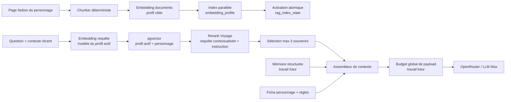

# DESIGN-001 — RAG Voyage 4, mémoire conversationnelle et budget de payload

- **Statut** : approuvé pour implémentation progressive
- **Créé le** : 2026-08-05
- **Périmètre immédiat** : index RAG, modèles Voyage, reranking, observabilité et dashboard `🔎 Configuration RAG`
- **Perspective** : mémoire structurée des tours et optimisation du payload OpenRouter
- **Plateforme de livraison** : Lovable / Lovable Cloud uniquement

## Sommaire

1. [Résumé de décision](#1-résumé-de-décision)
2. [Contexte et problèmes constatés](#2-contexte-et-problèmes-constatés)
3. [Exigences](#3-exigences)
4. [Options étudiées](#4-options-étudiées)
5. [Architecture cible](#5-architecture-cible)
6. [Modèles Voyage et profils](#6-modèles-voyage-et-profils)
7. [Contrats de données et API](#7-contrats-de-données-et-api)
8. [Dashboard Configuration RAG](#8-dashboard-configuration-rag)
9. [Trajectoire mémoire et payload LLM](#9-trajectoire-mémoire-et-payload-llm)
10. [Plan d’implémentation](#10-plan-dimplémentation)
11. [Validation et rollback](#11-validation-et-rollback)
12. [Architecture gates](#12-architecture-gates)

## 1. Résumé de décision

Le projet sort de `voyage-3`, désormais classé parmi les anciens modèles, au moyen de profils d’index explicites et versionnés.

Le profil recommandé pour le temps réel est :

| Étape | Modèle / valeur |
| --- | --- |
| Documents Notion | `voyage-4-large` |
| Questions live | `voyage-4-lite` |
| Dimension | 1024 |
| Type | `float` |
| Reranking live | `rerank-2.5-lite` |
| Mode qualité | `rerank-2.5` |
| Candidats initiaux | 8 à 12 |
| Souvenirs Max | 3 maximum |
| Troncature reranker | activée |

La série Voyage 4 partage un même espace vectoriel : les documents peuvent être indexés avec `voyage-4-large`, puis interrogés avec `voyage-4-lite` sans réindexation intermédiaire. C’est le cas d’usage asymétrique recommandé par Voyage pour concilier qualité documentaire et latence de lecture : [Voyage 4 shared embedding space](https://blog.voyageai.com/2026/01/15/voyage-4/).

`voyage-context-4` devient un profil expérimental de qualité. Il encode chaque chunk en tenant compte des autres chunks de la page du personnage, ce qui correspond aux récits AVA contenant timelines, pronoms et références dispersées : [Contextualized Chunk Embeddings](https://docs.voyageai.com/docs/contextualized-chunk-embeddings).

Le changement de profil utilise un **index parallèle** : le nouvel index est construit sans supprimer l’index actif, puis activé seulement après succès complet. Cette décision évite qu’un réglage sauvegardé pointe vers des vecteurs incompatibles.

## 2. Contexte et problèmes constatés

### 2.1 Implémentation actuelle

- `sync-notion` découpe chaque page en chunks d’environ 1 000 caractères avec 150 caractères de recouvrement.
- Chaque chunk est envoyé séparément à `voyage-3` avec `input_type=document`.
- `query-rag` vectorise la question avec `voyage-3`, `input_type=query`, en 1024 dimensions.
- pgvector récupère un vivier filtré par personnage.
- `rerank-2.5` ou `rerank-2.5-lite` reclasse les candidats.
- Max reçoit au maximum trois souvenirs, pour 2 100 ou 2 700 caractères selon la variante de prompt.
- Le live PRD4 abandonne le RAG après 2 000 ms.

### 2.2 Causes racines

1. **Modèle codé en dur** : le dashboard choisit un fournisseur, pas le modèle réellement utilisé par les deux Edge Functions.
2. **Fallback OpenAI non garanti** : une ligne contient un vecteur Voyage ou OpenAI, jamais nécessairement les deux. Après un rebuild Voyage, le fallback OpenAI peut interroger une colonne vide.
3. **Désalignement du reranker** : l’embedding reçoit la question et le contexte récent, tandis que le reranker reçoit la question brute.
4. **Couplage artificiel** : l’implémentation désactive le reranker Voyage avec un index OpenAI, alors qu’un reranker peut traiter les résultats de tout retrieval vectoriel ou lexical.
5. **Configuration trompeuse** : `top_k` peut monter à 15 dans l’UI, mais Max injecte au maximum trois souvenirs.
6. **Valeurs documentaires non mesurées** : la latence et les plages de scores présentées sont statiques au lieu de refléter les sessions réelles.
7. **Absence de métadonnées d’index** : le modèle, le type, le chunker et la date de reconstruction ne sont pas attachés aux vecteurs.

## 3. Exigences

### 3.1 Fonctionnelles

- Construire et activer un profil Voyage 4 depuis l’admin.
- Maintenir l’ancien index actif pendant la construction du nouveau.
- Conserver le cloisonnement strict par `character_id`.
- Envoyer la même intention contextualisée au retrieval et au reranker.
- Afficher la configuration **effective**, pas seulement la configuration désirée.
- Exposer clairement les trois niveaux : candidats, résultats rerankés, souvenirs injectés.
- Permettre de comparer `rerank-2.5-lite` et `rerank-2.5` dans le laboratoire.

### 3.2 Non fonctionnelles

- **Latence** : ne jamais augmenter le délai dur PRD4 de 2 000 ms ; cible RAG p50 proche de 250 ms.
- **Résilience** : une construction échouée ne modifie pas le profil actif.
- **Compatibilité** : aucune chaîne de build ou de déploiement extérieure à Lovable.
- **Sécurité** : secrets uniquement dans Lovable Cloud ; activation réservée aux administrateurs.
- **Traçabilité** : modèle de documents, modèle de requête, profil et scores conservés dans les traces.
- **Évolutivité raisonnée** : préparer la séparation RAG / mémoire / payload sans implémenter prématurément le futur moteur de mémoire.

## 4. Options étudiées

### Option A — Remplacer `voyage-3` en place

Modifier les modèles puis demander un wipe/rebuild.

- **Avantage** : très simple.
- **Inconvénient** : fenêtre d’incompatibilité ; un déploiement ou rebuild partiel peut rendre le RAG vide.
- **Décision** : rejetée.

### Option B — Conserver en permanence Voyage et OpenAI en double

Calculer deux vecteurs par chunk.

- **Avantage** : fallback fournisseur immédiat.
- **Inconvénient** : double coût, double stockage, deux distributions de seuil à maintenir, peu de valeur avec un petit corpus.
- **Décision** : rejetée pour le moment.

### Option C — Profils d’index parallèles, activation atomique

Chaque ligne porte un `embedding_profile`. Un état singleton désigne le profil actif. Le rebuild écrit un profil parallèle, puis bascule l’état seulement à la fin.

- **Avantage** : migration sûre, rollback immédiat, métadonnées observables, compatible avec les futurs tests Context 4.
- **Inconvénient** : anciens vecteurs conservés jusqu’au nettoyage explicite.
- **Décision** : retenue.

## 5. Architecture cible



### Frontières de responsabilité

- **Index documentaire** : faits canoniques issus de Notion, indépendants de la session.
- **Mémoire conversationnelle** : informations essentielles apprises pendant la session, avec provenance et fraîcheur.
- **Assembleur de contexte** : sélectionne les blocs utiles au tour courant.
- **Budget de payload** : arbitre la taille totale envoyée au LLM et trace toute omission.

Cette séparation empêche qu’une future compression de conversation soit implémentée comme un réglage supplémentaire de `top_k` ou comme une concaténation opaque dans le RAG.

## 6. Modèles Voyage et profils

### `voyage-3-legacy`

- Documents et questions : `voyage-3`
- 1024 dimensions, float
- Profil de rollback des vecteurs existants

### `voyage-4-realtime` — recommandé

- Documents : `voyage-4-large`
- Questions : `voyage-4-lite`
- 1024 dimensions, float
- Chunking Notion déterministe actuel
- Optimisé pour la contrainte voix-à-voix

### `voyage-context-4-quality` — expérimental

- Documents et questions : `voyage-context-4`
- Endpoint `/v1/contextualizedembeddings`
- Les chunks d’une page sont envoyés ensemble afin que chaque vecteur reçoive le contexte de la page entière.
- Recouvrement désactivé (`overlap=0`), conformément à la recommandation Voyage pour des chunks contextualisés pré-découpés.
- 1024 dimensions, float
- À promouvoir uniquement après comparaison qualité/latence sur le corpus réel.

### `openai-legacy`

- `text-embedding-3-small`, 1536 dimensions
- Profil explicite de compatibilité, pas fallback implicite

### Dimension et quantification

1024 float reste le défaut. Les types Voyage quantifiés ne réduiraient pas le stockage du type pgvector `vector` actuel sans migration de type. Les index HNSW pgvector sur `vector` acceptent jusqu’à 2 000 dimensions ; 2048 demanderait notamment `halfvec` et une migration supplémentaire : [pgvector](https://github.com/pgvector/pgvector).

## 7. Contrats de données et API

### 7.1 Métadonnées sur `embeddings`

| Colonne | Rôle |
| --- | --- |
| `embedding_profile` | espace vectoriel logique |
| `embedding_model` | modèle ayant produit le document |
| `embedding_dimension` | dimension réelle |
| `embedding_dtype` | `float`, futur `int8`, etc. |
| `chunking_strategy` | version du chunker |
| `chunk_index` / `chunk_count` | position dans la page |
| `indexed_at` | fraîcheur de l’index |

### 7.2 `rag_index_state`

Singleton indiquant : profil actif, modèles document/requête, endpoint, dimension, dtype, chunking, nombre de chunks et date du rebuild.

### 7.3 `sync-notion`

Champs ajoutés à la requête admin :

```json
{
  "rag_profile": "voyage-4-realtime",
  "activate_profile": true,
  "mode": "rag_only"
}
```

Un profil déjà construit et non vide peut être réactivé sans rebuild pour rollback/canary :

```json
{
  "rag_profile": "voyage-3-legacy",
  "activate_existing_profile": true
}
```

Garanties :

1. effacer uniquement les lignes du profil cible ;
2. construire tous les personnages ;
3. ne jamais modifier l’état actif pendant la construction ;
4. activer après tous les inserts réussis ;
5. laisser l’ancien profil disponible pour rollback.

### 7.4 `query-rag`

L’Edge Function lit le profil actif côté serveur. Le client ne choisit plus arbitrairement un espace vectoriel.

La réponse ajoute :

```json
{
  "embedding_profile": "voyage-4-realtime",
  "document_embedding_model": "voyage-4-large",
  "query_embedding_model": "voyage-4-lite",
  "embedding_dimension": 1024,
  "embedding_dtype": "float",
  "rerank_query": "..."
}
```

## 8. Dashboard Configuration RAG

### État effectif

- profil actif et statut ;
- modèles document/requête ;
- dimension et dtype ;
- stratégie de chunking ;
- date et volume du dernier rebuild ;
- alerte si la table de métadonnées ou une migration manque.

### Profils

- cartes `Temps réel`, `Qualité contextualisée`, `Legacy` ;
- bouton `Construire et activer` ;
- explication de la construction parallèle et du rollback ;
- aucune activation par simple sauvegarde d’un select.

### Résultats live

- échantillon de tours ;
- latence RAG p50/p95 ;
- taux de zéro résultat ;
- comparaison avec cible 250 ms et deadline 2 000 ms.

### Réglages avancés

- reranker et troncature ;
- seuil cosine ;
- `retrieve_k` ;
- résultats finaux ;
- limite effective de trois souvenirs et budget en caractères.

Les estimations génériques de latence sont remplacées par les mesures de l’application. `rerank-2.5-lite` devient le défaut live car Voyage le destine aux usages sensibles à la latence ; `rerank-2.5` reste disponible pour les comparaisons de qualité : [Rerankers](https://docs.voyageai.com/docs/reranker).

## 9. Trajectoire mémoire et payload LLM

### 9.1 Problème futur

Le payload actuel combine historique récent, résumé de session, fiche personnage, guidance, RAG et règles. Réduire seulement le nombre de messages ne garantit ni la conservation des informations essentielles ni la suppression des duplications.

### 9.2 Mémoire structurée cible

Une future `ConversationMemoryState` devrait conserver des éléments structurés plutôt qu’un paragraphe libre unique :

- identité et rôle de l’interlocuteur ;
- faits explicitement donnés par l’utilisateur ;
- faits déjà révélés par Max ;
- décisions, promesses et questions ouvertes ;
- état relationnel ou émotionnel utile ;
- sujets couverts et niveau narratif atteint ;
- provenance (`turn_id`) et dernière confirmation ;
- résumé très court du dernier échange.

Chaque tour produira un delta de mémoire, fusionné de façon déterministe. Le texte intégral restera dans la trace et la base de session, mais ne sera plus systématiquement renvoyé au LLM.

### 9.3 Assembleur et budgets futurs

Le futur assembleur doit gérer des budgets indépendants :

| Budget | Contenu | Politique |
| --- | --- | --- |
| Statique | identité, règles, profondeur | compilé et borné |
| Mémoire | faits de session essentiels | priorité, fraîcheur, déduplication |
| RAG | faits canoniques du récit | pertinence du tour, max 3 souvenirs |
| Historique récent | continuité linguistique | 1–2 échanges, pas toute la session |
| Réponse | sortie orale Max | phrases/tokens bornés |

L’assembleur devra produire un `ContextBudgetReport` : taille originale, taille incluse, omissions, duplications supprimées et raison de chaque décision. Ce rapport prolongera le mécanisme de budget déjà présent dans `MaxPromptAssemblyTrace`.

### 9.4 Ordre de travaux recommandé

1. Stabiliser et mesurer le nouveau RAG.
2. Définir le schéma de mémoire structurée et ses invariants.
3. Rejouer des traces existantes pour comparer mémoire actuelle et mémoire structurée.
4. Introduire l’assembleur de contexte global.
5. Compresser la structure du payload et du system prompt sans perdre la causalité des traces.
6. Effectuer un canary basé sur qualité narrative, hallucinations, tokens et temps de première voix.

## 10. Plan d’implémentation

### Phase 1 — Correctifs sans changement d’index

- utiliser la même requête contextualisée pour retrieval et reranking ;
- ajouter l’instruction de pertinence AVA au reranker ;
- découpler reranking et fournisseur d’embedding ;
- passer le défaut live à `rerank-2.5-lite` ;
- corriger la terminologie et les limites du dashboard.

### Phase 2 — Profils et activation sûre

- migration de métadonnées et `rag_index_state` ;
- registre partagé de profils ;
- génération Voyage batchée par personnage ;
- construction parallèle et activation atomique ;
- métadonnées dans les réponses et traces.

### Phase 3 — Dashboard

- état effectif ;
- cartes de profils et commande d’activation ;
- statistiques p50/p95 et taux de miss ;
- budgets RAG réellement appliqués.

### Phase 4 — Évaluation

- jeux de questions avec chunks/faits attendus ;
- comparaison Recall@K, réussite top-3, MRR/NDCG, latence et coût ;
- décision de promotion de `voyage-context-4-quality`.

### Phase 5 — Mémoire et payload

- spécification dédiée ;
- mémoire structurée par deltas ;
- assembleur à budgets ;
- optimisation du payload OpenRouter ;
- replay et canary.

## 11. Validation et rollback

### Tests automatisés

- validation du registre de profils ;
- sérialisation des métadonnées `query-rag` ;
- conservation de la requête réellement vectorisée et rerankée ;
- limite d’injection à trois souvenirs ;
- build TypeScript/Vite et tests orchestrateur.

### Validation Lovable Cloud

1. appliquer la migration dans Lovable Cloud ;
2. publier `sync-notion` et `query-rag` via Lovable ;
3. vérifier que le profil actif reste `voyage-3-legacy` ;
4. construire `voyage-4-realtime` depuis l’admin ;
5. contrôler volume et métadonnées ;
6. exécuter les questions du Laboratoire RAG ;
7. surveiller latence, misses et traces ;
8. rollback : réactiver `voyage-3-legacy` si nécessaire.

## 12. Architecture gates

| Gate | Statut | Justification |
| --- | --- | --- |
| Simplicité | PASS | Quatre profils explicites, aucune nouvelle infrastructure |
| Type safety | PASS | Union fermée des profils et métadonnées typées |
| Clean code | PASS | Registre partagé, Edge Functions responsables de l’effectif |
| Test-first | PASS | Contrats et diagnostics testés avant promotion Cloud |
| Architecture backend | PASS | Notion → Edge Function → Lovable Postgres/pgvector |
| Architecture frontend | PASS | Le dashboard orchestre ; il ne décide pas seul de l’index actif |
| Nommage | PASS | Identifiants de profil stables et explicites |

### Complexité suivie

La coexistence temporaire de plusieurs profils augmente le stockage. Le corpus actuel est petit et ce coût achète une activation et un rollback sûrs. Le nettoyage des profils retraités devra rester une action admin explicite, jamais automatique pendant la construction.
