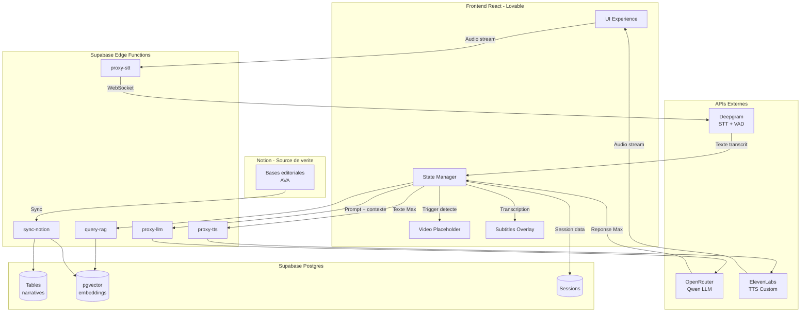
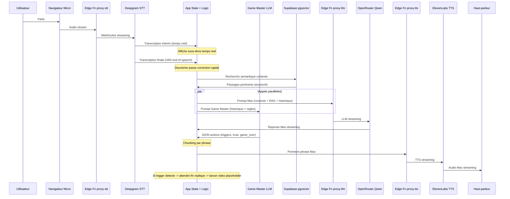
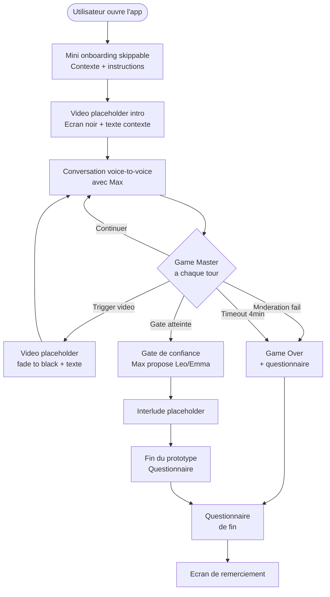

# PRD Prototype 1 mars 2026

État: En cours
Catégorie: Prototype
👝 Tâches Storygami: Générer PRD Prototype 1 (https://www.notion.so/G-n-rer-PRD-Prototype-1-30962322e595807ba32feb452cf2c8bc?pvs=21)
Dernière modification: 8 mars 2026 11:18
Date de création: 7 mars 2026 11:45
Créé par: Ulrich Fischer

<aside>
🎯

**PRD Prototype 1 — "Parle à Max"** | Version 1.0 — 8 mars 2026

Application web voice-to-voice avec le personnage de Max, dans l'univers fictionnel de "Où est Ava ?". Focus : **mécanique technique** (pipeline voice, triggers vidéo, RAG Notion → Supabase). Gameplay, contenus et UI/UX viendront dans les itérations suivantes.

</aside>

---

## 1. Objectif du prototype

Créer une application web self-contained permettant à un utilisateur de converser en **voice-to-voice** avec le personnage de Max. Le prototype valide :

- Le **pipeline voice-to-voice** complet (STT → LLM → TTS) avec latence minimale
- Le **système de triggers vidéo** piloté par un Game Master IA autonome
- La **mécanique RAG** Notion → Supabase → embeddings → prompt enrichi
- La **boucle conversationnelle** avec gestion d'état, confiance et game over

<aside>
⚠️

**Ce qui est HORS SCOPE du Prototype 1** : A/B tests, PostHog analytics, branche femme, interface Zoom fidèle, webcam utilisateur, vraies vidéos (mode placeholder uniquement).

</aside>

---

## 2. Contraintes et périmètre

| **Paramètre** | **Décision** |
| --- | --- |
| Personnage | Max uniquement — **branche homme** uniquement |
| Plateforme | Desktop only (Chrome recommandé) |
| Autonomie | 100% autonome — pas de game master humain |
| Auth | Aucun login — session locale (localStorage) |
| Vidéos | **Mode placeholder** — écran noir + texte descriptif (vidéos pas encore prêtes) |
| UI | Écran simple, minimaliste — focus sur la mécanique, pas sur le design |
| Webcam | Pas de webcam utilisateur |
| Avatar temps réel | Hors scope — image statique de Max |
| A/B tests | Hors scope — deuxième temps |
| Analytics | Hors scope — PostHog ajouté après |
| Timeout | **4 minutes** max de conversation avant game over |

---

## 3. Stack technique

| **Couche** | **Outil** | **Rôle** |
| --- | --- | --- |
| Frontend | React + Tailwind (Lovable) | Application web SPA, dark theme cinématique |
| Backend/BDD | Supabase (Postgres + pgvector) | Données narratives, sessions, RAG embeddings |
| Edge Functions | Supabase Edge Functions (Deno) | Proxy sécurisé pour toutes les clés API (OpenRouter, Deepgram, ElevenLabs) |
| LLM | OpenRouter API — **Qwen** | Moteur conversationnel Max + Game Master (switch facile entre modèles) |
| STT | Deepgram (WebSocket streaming) | Speech-to-Text temps réel avec VAD intégré |
| TTS | ElevenLabs (streaming API) | Text-to-Speech — voix custom de Max (clé + voice ID fournis par Ulrich) |
| Vidéo | Mode placeholder (proto) → Gumlet (futur) | Écran noir + texte descriptif pour tester les triggers |
| Sync données | Notion API → Supabase | Source de vérité dans Notion, miroir auto vers Supabase + embeddings pgvector |

---

## 4. Architecture

### 4.1 Schéma global



### 4.2 Gestion de l'état

**Côté client (React state/context)** :

- Phase en cours (`onboarding` | `intro_video` | `conversation` | `video_trigger` | `gate` | `game_over` | `questionnaire`)
- Historique de conversation (messages utilisateur + Max)
- Compteur de questions posées
- Niveau de confiance (`trust_level`)
- Liste des triggers déjà activés (`triggered_ids[]`)
- Timer de session (countdown 4 min)
- État audio (micro actif, Max parle, silence)

**Côté Supabase** :

- Sauvegarde de session (pour reprise et analyse)
- Logs de conversation complets
- Timestamps de chaque interaction

---

## 5. Pipeline Voice-to-Voice

### 5.1 Flow détaillé



### 5.2 STT — Deepgram avec VAD

**Configuration** :

- WebSocket streaming en temps réel (pas de batch)
- **VAD (Voice Activity Detection)** activé côté Deepgram pour détecter la fin de parole
- Langue : `fr` (français)
- Modèle : `nova-2` (ou dernier disponible)

**Double passe de transcription** :

1. **Passe 1 — Temps réel** : résultats `interim` affichés en sous-titres au fur et à mesure que l'utilisateur parle
2. **Passe 2 — Correction** : résultat `final` de Deepgram (plus précis) utilisé comme input pour le LLM. Délai quasi nul car Deepgram produit le `final` dès la détection de fin de parole par VAD

### 5.3 LLM — OpenRouter (Qwen)

**Configuration** :

- Modèle par défaut : `qwen/qwen-2.5-72b-instruct` (configurable dans `settings.json`)
- Streaming activé pour réduire la latence perçue
- Deux appels LLM **parallèles** à chaque tour :
    1. **Agent Max** : génère la réponse conversationnelle
    2. **Agent Game Master** : évalue l'échange et retourne des actions JSON

### 5.4 TTS — ElevenLabs streaming

**Configuration** :

- Voix custom de Max (voice ID fourni par Ulrich)
- API streaming : commencer la lecture audio dès la première phrase
- **Chunking intelligent** : découper la réponse LLM par phrase (détection `.` `!` `?`) et envoyer chaque chunk au TTS progressivement
- Langue : français

### 5.5 Optimisation latence

| **Technique** | **Implémentation** | **Gain estimé** |
| --- | --- | --- |
| Deepgram WebSocket streaming | Pas de batch, transcription continue | STT quasi-instantané |
| VAD natif Deepgram | Détection fin de parole côté serveur | Évite les coupures prématurées |
| LLM streaming | OpenRouter avec `stream: true` | Premières phrases en ~500ms |
| Appels Max + Game Master en parallèle | `Promise.all()` sur les deux appels LLM | Pas de latence séquentielle |
| Chunking TTS par phrase | Envoi au TTS dès la première phrase complète du LLM | Max commence à "parler" en ~1-2s |
| ElevenLabs streaming | API streaming, lecture dès réception du premier chunk audio | Pas d'attente du texte complet |

---

## 6. Agents IA

### 6.1 Agent Max — Personnage conversationnel

**Rôle** : incarner Max en dialogue voice-to-voice, première personne, français uniquement.

**Prompt système** (chargé depuis Supabase, synchronisé depuis Notion) :

- Personnalité, backstory, émotions de Max
- Branche homme uniquement pour le proto
- Règles strictes : jamais de méta-commentaires, jamais de narration à la 3e personne, émotions uniquement par les mots et le ton
- Contexte enrichi par RAG (passages pertinents du storyworld injectés dynamiquement)
- Si un trigger vidéo vient d'être joué ET que le champ `contexte_post_video` existe → ce texte est ajouté au prompt. Max **peut** y faire référence si c'est cohérent avec la discussion, mais **n'est pas obligé**

**Input à chaque tour** :

- Prompt système (depuis Supabase)
- Historique de conversation (derniers N échanges)
- Contexte RAG (top-K passages pertinents depuis pgvector)
- Éventuel contexte post-vidéo
- Transcription corrigée de l'utilisateur

**Output** : texte de la réponse de Max (streamé vers TTS)

### 6.2 Agent Game Master — Orchestrateur

**Rôle** : évaluer chaque échange et piloter la mise en scène. **Appel LLM à chaque tour de parole.**

**Prompt système** (chargé depuis Supabase) :

- Règles du jeu, seuils, comportements attendus
- Liste des triggers disponibles (avec thèmes) chargée depuis la table `video_triggers`
- Liste des triggers déjà activés dans cette session

**Input à chaque tour** :

- Historique complet de la conversation
- État actuel (trust_level, triggers activés, temps écoulé, phase)
- Règles du jeu (depuis Supabase)
- Dernier message utilisateur + réponse Max

**Output** : JSON structuré

```json
{
  "trust_delta": 1,
  "trigger_video_id": null,
  "game_over": false,
  "game_over_reason": null,
  "gate_reached": false,
  "moderation_flag": false,
  "notes": "L'utilisateur a repondu sincerement a la question sur sa famille"
}
```

**Logique de décision** :

- `trust_delta` : +1 si réponse sincère, 0 si neutre, -1 si évasive
- `trigger_video_id` : ID d'un trigger vidéo à jouer si un thème matche (et pas déjà joué)
- `game_over: true` si comportement inapproprié OU timeout 4 min atteint
- `gate_reached: true` si `trust_level >= TRUST_THRESHOLD` (10 par défaut)

---

## 7. Système de triggers vidéo

### 7.1 Types de vidéos

| **Type** | **Quand** | **Comportement proto (placeholder)** |
| --- | --- | --- |
| `intro` | Au démarrage, après l'onboarding | Écran noir + texte : "[Cinématique d'introduction — contexte pandémie, Ava disparue]" |
| `mid_conversation` | Pendant la conversation, quand le Game Master détecte un thème clé | Écran noir + texte : "[Vidéo trigger : {titre} — Thème : {thème détecté}]" + durée simulée 10s |
| `interlude` | Après la gate de confiance, transition vers la suite | Écran noir + texte : "[Interlude narratif — transition]" |

### 7.2 Mécanique de déclenchement mid-conversation

1. Le Game Master retourne `trigger_video_id` dans son JSON
2. L'app **attend la fin de la réplique en cours de Max** (fin du TTS audio)
3. **Transition fade to black** (simple fondu au noir)
4. Affichage du placeholder vidéo (écran noir + texte descriptif) pendant une durée simulée
5. Fin du placeholder → reprise de la conversation
6. Si le trigger a un `contexte_post_video` → injecté dans le prochain prompt de Max
7. Le trigger est marqué comme `already_triggered` dans l'état client (pas rejouable)

### 7.3 Structure d'un trigger (table Supabase `video_triggers`)

```json
{
  "id": "uuid",
  "title": "Flashback famille Max",
  "type": "mid_conversation",
  "themes": ["famille", "parents", "enfance"],
  "video_url": null,
  "placeholder_text": "Sequence video : Max se souvient de son enfance avec Ava",
  "priority": 1,
  "transition_style": "fade_black",
  "post_video_context": "L'utilisateur vient de voir un flashback de ton enfance avec Ava. Tu peux en parler si la conversation s'y prete.",
  "gameplay_step_id": "uuid",
  "duration_seconds": 10
}
```

---

## 8. Pipeline RAG : Notion → Supabase → Embeddings

<aside>
🧠

**Objectif principal du proto** : valider la mécanique technique complète Notion → Supabase → pgvector → prompt enrichi. Les contenus sont minimalistes, mais le pipeline doit être fonctionnel de bout en bout.

</aside>

### 8.1 Bases Notion (source de vérité)

4 bases éditoriales dans Notion :

- 🐼 **Base Caractères AVA** → fiches personnages, prompts, personnalité de Max
- 📦 **Storyworld AVA** → univers, lieux, thématiques, secrets
- 🎮 **Gameplay AVA** → étapes de l'expérience, conditions, progression
- 🎬 **Vidéos AVA** → catalogue vidéo, thèmes de déclenchement, transitions

### 8.2 Tables Supabase

| **Table** | **Contenu** | **Source Notion** |
| --- | --- | --- |
| `characters` | Fiches personnages (prompts, personnalité, backstory) | Base Caractères AVA |
| `storyworld` | Contexte global, lieux, thématiques, secrets | Storyworld AVA |
| `video_triggers` | Triggers avec thèmes, placeholder text, priorité, transitions | Vidéos AVA |
| `gameplay_steps` | Étapes de l'expérience avec ordre, conditions, types | Gameplay AVA |
| `rules` | Règles du jeu, modération, seuils | Page dédiée Notion |
| `sessions` | Sessions utilisateur (progression, conversation, timestamps) | Générées par l'app |
| `embeddings` | Vecteurs pgvector pour recherche sémantique | Calculés à chaque sync |

### 8.3 Sync Notion → Supabase

**Implémentation** : Supabase Edge Function `sync-notion`

- Appelée manuellement (bouton dans l'app ou endpoint) pour le proto
- Pull les bases Notion via l'API Notion
- Met à jour les tables Supabase correspondantes
- Pour chaque texte narratif (backstory, storyworld, règles) → génère un embedding via OpenAI Embeddings API
- Stocke les embeddings dans la table `embeddings` avec pgvector

### 8.4 Requête RAG à chaque tour

1. Prendre le dernier message utilisateur + contexte conversation
2. Générer un embedding de la requête
3. Recherche sémantique dans pgvector (top-5 passages les plus proches)
4. Injecter les passages dans le prompt de Max comme contexte additionnel

---

## 9. Variables configurables

Toutes stockées dans un fichier `settings.json` ET dans Supabase (priorité Supabase si disponible) :

| **Variable** | **Description** | **Valeur par défaut** |
| --- | --- | --- |
| `TRUST_THRESHOLD` | Trust level pour débloquer la gate (Léo/Emma) | 10 |
| `TIMEOUT_SECONDS` | Durée max de conversation avant game over | 240 (4 minutes) |
| `MAX_INSULT_TOLERANCE` | Nombre de propos hors-cadre avant game over | 1 |
| `MIN_QUESTIONS_BEFORE_GATE` | Minimum d'échanges avant proposition gate | 10 |
| `LLM_MODEL` | Modèle OpenRouter | `qwen/qwen-2.5-72b-instruct` |
| `TTS_VOICE_ID` | Voix ElevenLabs custom Max | (fourni par Ulrich) |
| `RAG_TOP_K` | Nombre de passages RAG à injecter | 5 |
| `VIDEO_PLACEHOLDER_DURATION` | Durée d'affichage des placeholders vidéo | 10 secondes |
| `DEEPGRAM_LANGUAGE` | Langue STT | `fr` |

---

## 10. Écrans et flow utilisateur

### 10.1 Flow complet



### 10.2 Écran 1 — Onboarding (skippable)

Écran simple, dark theme, avec :

- Titre : "Où est Ava ?"
- Texte court expliquant le contexte (pandémie, Ava disparue, Max te contacte en visio)
- Ce qu'on attend de l'utilisateur (parler sincèrement avec Max)
- Mention que c'est un prototype expérimental
- Bouton "Commencer" + lien "Passer" pour skipper
- Indication technique : "Autorisez l'accès au micro quand demandé"

### 10.3 Écran 2 — Vidéo d'intro (placeholder)

Écran noir avec texte descriptif centré, typographie cinéma :

- "[Cinématique d'introduction]"
- Description du contenu prévu
- Durée simulée (10s) avec barre de progression
- Bouton "Passer" en bas à droite

### 10.4 Écran 3 — Conversation avec Max (écran principal)

Layout simple, plein écran, dark theme :

- **Zone centrale** : image statique de Max (photo placeholder si pas encore fournie)
- **Indicateur micro** : icône micro avec animation quand l'utilisateur parle (VAD détecte la voix)
- **Sous-titres utilisateur** : en bas, texte gris, affiché en temps réel (passe 1 Deepgram)
- **Sous-titres Max** : en bas, texte blanc, affiché pendant que Max parle
- **Timer** : compteur discret en haut à droite (temps restant sur 4 min)
- **Indicateur de confiance** : petit compteur discret (ex: "Confiance: 3/10")
- **Indicateur d'état** : "Max écoute..." / "Max réfléchit..." / "Max parle..."

### 10.5 Écran 4 — Placeholder vidéo (trigger)

- Transition : fondu au noir (fade_black)
- Écran noir avec texte blanc centré : titre + description du trigger
- Barre de progression (durée simulée configurable)
- Bouton "Passer" discret
- À la fin → retour à l'écran conversation

### 10.6 Écran 5 — Game Over

- Fondu au noir
- Texte : raison du game over (timeout / comportement inapproprié / fin d'expérience)
- Bouton "Recommencer"
- Transition automatique vers le questionnaire

### 10.7 Écran 6 — Questionnaire de fin

Formulaire intégré dans l'app (pas de redirection externe). Questions courtes :

**1. Expérience globale**

- Note de l'expérience (slider 1-10)
- En un mot, décrivez ce que vous venez de vivre (texte libre)
- Recommanderiez-vous cette expérience ? (NPS 0-10)

**2. Immersion**

- Vous êtes-vous senti·e "dans l'histoire" ? (1-5)
- La conversation avec Max était-elle naturelle ? (1-5)

**3. Mécanique**

- Max vous écoutait-il vraiment ? (1-5)
- La latence vous a-t-elle gêné·e ? (pas du tout / un peu / beaucoup)

**4. Narration**

- Avez-vous compris ce qu'on attendait de vous ? (oui / non / partiellement)
- Envie de continuer / d'en savoir plus ? (1-5)

**5. Valeur perçue**

- Prêt·e à payer pour une version complète ? (oui / non / peut-être)
- Fourchette de prix (0-5€ / 5-15€ / 15-30€ / 30€+)
- Format préféré (web / mobile / VR / autre)

**6. Ouvert**

- Qu'améliorer en priorité ? (texte libre)

Résultats stockés dans Supabase (`sessions` table, champ `questionnaire_responses` JSON).

---

## 11. Supabase Edge Functions

### 11.1 Liste des Edge Functions

| **Fonction** | **Rôle** | **Secrets nécessaires** |
| --- | --- | --- |
| `proxy-llm` | Proxy vers OpenRouter API (Max + Game Master) | `OPENROUTER_API_KEY` |
| `proxy-tts` | Proxy vers ElevenLabs streaming API | `ELEVENLABS_API_KEY`, `ELEVENLABS_VOICE_ID` |
| `proxy-stt` | Fournir le token Deepgram pour la connexion WebSocket client | `DEEPGRAM_API_KEY` |
| `query-rag` | Recherche sémantique pgvector + génération embedding requête | `OPENAI_API_KEY` (pour embeddings) |
| `sync-notion` | Synchronisation Notion → Supabase + génération embeddings | `NOTION_API_KEY`, `OPENAI_API_KEY` |
| `save-session` | Sauvegarde données de session et questionnaire | (clé Supabase service role) |

### 11.2 Sécurité

- **Aucune clé API côté client** — tout passe par les Edge Functions
- Seule la clé Supabase `anon` (publique) est côté client
- Les Edge Functions utilisent les Supabase Secrets pour stocker les clés
- CORS configuré pour n'accepter que le domaine de l'app

---

## 12. Structure de fichiers

```jsx
src/
├── config/
│   └── settings.json          // Variables configurables (seuils, modele LLM, voice ID)
├── components/
│   ├── App.tsx                // Router principal entre ecrans
│   ├── OnboardingScreen.tsx   // Mini onboarding skippable
│   ├── VideoPlaceholder.tsx   // Placeholder ecran noir + texte
│   ├── ConversationScreen.tsx // Ecran principal voice-to-voice
│   ├── SubtitleOverlay.tsx    // Sous-titres temps reel
│   ├── GameOverScreen.tsx     // Ecran de fin
│   └── QuestionnaireScreen.tsx// Questionnaire integre
├── agents/
│   ├── maxAgent.ts            // Construction prompt Max + appel LLM
│   └── gameMasterAgent.ts     // Construction prompt Game Master + parsing JSON
├── services/
│   ├── deepgramSTT.ts         // WebSocket Deepgram via Edge Function token
│   ├── elevenLabsTTS.ts       // Streaming TTS via Edge Function proxy
│   ├── openRouterLLM.ts       // Streaming LLM via Edge Function proxy
│   ├── ragService.ts          // Requetes RAG via Edge Function
│   ├── sessionService.ts      // Sauvegarde session Supabase
│   └── supabaseClient.ts      // Client Supabase init
├── hooks/
│   ├── useConversation.ts     // State machine conversation
│   ├── useVoice.ts            // Gestion micro + audio playback
│   ├── useTriggers.ts         // Logique declenchement triggers
│   ├── useTimer.ts            // Countdown 4 min
│   └── useGameState.ts        // Etat global (phase, trust, triggers)
├── types/
│   └── index.ts               // Types partages
└── lib/
    └── chunkText.ts           // Utilitaire chunking par phrase pour TTS

supabase/
├── functions/
│   ├── proxy-llm/
│   │   └── index.ts
│   ├── proxy-tts/
│   │   └── index.ts
│   ├── proxy-stt/
│   │   └── index.ts
│   ├── query-rag/
│   │   └── index.ts
│   ├── sync-notion/
│   │   └── index.ts
│   └── save-session/
│       └── index.ts
└── migrations/
    └── 001_init.sql            // Schema initial (tables + pgvector)
```

---

## 13. Étapes gameplay (Prototype 1)

| **Ordre** | **Étape** | **Type** | **Condition** | **Proto** |
| --- | --- | --- | --- | --- |
| 1 | Mini onboarding | `intro` | Lancement de l'app | Écran texte skippable |
| 2 | Cinématique d'intro | `intro` | Après onboarding | Placeholder 10s |
| 3 | Conversation avec Max | `conversation` | Après intro | Voice-to-voice + triggers mid-conv |
| 4 | Gate de confiance | `gate` | trust_level ≥ 10 | Max propose d'appeler Léo/Emma |
| 5 | Interlude narratif | `interlude` | Après gate | Placeholder transition |
| 6 | Fin d'expérience | `game_over` | Timeout 4min / insulte / complétion | Game over → questionnaire |

---

## 14. APIs et clés nécessaires

| **Service** | **Clé / Config** | **Stockage** | **Coût proto** |
| --- | --- | --- | --- |
| Supabase | Project URL + Anon Key + Service Role Key | Anon key côté client, service role dans Edge Functions | Free tier |
| OpenRouter | API Key | Supabase Secret → Edge Function `proxy-llm` | ~$0.01-0.05/conversation |
| Deepgram | API Key | Supabase Secret → Edge Function `proxy-stt` | 200$ crédits gratuits |
| ElevenLabs | API Key + Voice ID custom | Supabase Secrets → Edge Function `proxy-tts` | Abonnement 1 an gratuit |
| OpenAI | API Key (pour embeddings uniquement) | Supabase Secret → Edge Functions `query-rag` et `sync-notion` | ~$0.001/requête |
| Notion | Integration Token (read-only) | Supabase Secret → Edge Function `sync-notion` | Gratuit |

---

## 15. Contenu éditorial minimum pour le proto

<aside>
📋

**Contenu minimum** à préparer dans Notion AVANT de lancer le dev. Le pipeline RAG sera en place, mais les contenus peuvent être minimalistes pour tester la mécanique.

</aside>

### Indispensable

- [ ]  **Prompt système Max (branche homme)** — personnalité, ton, règles de conversation
- [ ]  **Prompt système Game Master** — règles d'évaluation, format JSON output, critères de trust/modération
- [ ]  **Fichier règles du jeu** — seuils (trust, timeout, tolérance insultes), comportements
- [ ]  **2-3 triggers vidéo placeholder** dans Vidéos AVA — avec thèmes et contexte post-vidéo
- [ ]  **6 étapes gameplay** dans Gameplay AVA — structure minimale du proto
- [ ]  **Storyworld condensé** — quelques paragraphes suffisent pour le RAG
- [ ]  **Fiche Max** dans Base Caractères AVA — backstory, personnalité, relation avec Ava
- [ ]  **Voix ElevenLabs custom** — clé API + voice ID (Ulrich)
- [ ]  **Visuel Max** — une photo statique pour l'écran de conversation

### Peut attendre

- Questions de Max ordonnées par priorité
- Exemples de dialogues
- Musique d'ambiance
- Vraies vidéos (placeholder OK pour le proto)

---

## 16. Schema SQL initial (Supabase migration)

```sql
-- Enable pgvector extension
create extension if not exists vector;

-- Characters table
create table characters (
  id uuid primary key default gen_random_uuid(),
  notion_id text unique,
  name text not null,
  system_prompt text,
  backstory text,
  personality text,
  branch text default 'male',
  created_at timestamptz default now(),
  updated_at timestamptz default now()
);

-- Storyworld table
create table storyworld (
  id uuid primary key default gen_random_uuid(),
  notion_id text unique,
  title text not null,
  content text,
  category text,
  created_at timestamptz default now(),
  updated_at timestamptz default now()
);

-- Video triggers table
create table video_triggers (
  id uuid primary key default gen_random_uuid(),
  notion_id text unique,
  title text not null,
  type text not null check (type in ('intro', 'interlude', 'mid_conversation')),
  themes text[] default '{}',
  video_url text,
  placeholder_text text,
  priority integer default 1,
  transition_style text default 'fade_black',
  post_video_context text,
  gameplay_step_id uuid references gameplay_steps(id),
  duration_seconds integer default 10,
  created_at timestamptz default now(),
  updated_at timestamptz default now()
);

-- Gameplay steps table
create table gameplay_steps (
  id uuid primary key default gen_random_uuid(),
  notion_id text unique,
  name text not null,
  step_order integer,
  type text not null check (type in ('intro', 'conversation', 'interlude', 'mid_conversation', 'gate', 'game_over')),
  trigger_condition text,
  description text,
  created_at timestamptz default now(),
  updated_at timestamptz default now()
);

-- Rules table
create table rules (
  id uuid primary key default gen_random_uuid(),
  notion_id text unique,
  title text not null,
  content text,
  category text,
  created_at timestamptz default now(),
  updated_at timestamptz default now()
);

-- Sessions table
create table sessions (
  id uuid primary key default gen_random_uuid(),
  started_at timestamptz default now(),
  ended_at timestamptz,
  branch text default 'male',
  trust_level integer default 0,
  triggers_activated text[] default '{}',
  game_over_reason text,
  conversation_log jsonb default '[]',
  questionnaire_responses jsonb,
  duration_seconds integer
);

-- Embeddings table (pgvector)
create table embeddings (
  id uuid primary key default gen_random_uuid(),
  source_table text not null,
  source_id uuid not null,
  content text not null,
  embedding vector(1536),
  created_at timestamptz default now()
);

-- Index for similarity search
create index on embeddings using ivfflat (embedding vector_cosine_ops) with (lists = 100);

-- Function for similarity search
create or replace function match_embeddings(
  query_embedding vector(1536),
  match_count int default 5,
  match_threshold float default 0.7
)
returns table (
  id uuid,
  source_table text,
  source_id uuid,
  content text,
  similarity float
)
language sql stable
as $$
  select
    id,
    source_table,
    source_id,
    content,
    1 - (embedding <=> query_embedding) as similarity
  from embeddings
  where 1 - (embedding <=> query_embedding) > match_threshold
  order by embedding <=> query_embedding
  limit match_count;
$$;
```

---

## 17. Prochaines étapes immédiates

- [ ]  **Ulrich** : générer la voix custom Max dans ElevenLabs → fournir API key + voice ID
- [ ]  **Ulrich** : créer les comptes et récupérer les clés API (OpenRouter, Deepgram 200$ crédits, Supabase, OpenAI pour embeddings)
- [ ]  **Benoît** : remplir le contenu éditorial minimum dans les bases Notion (Caractères AVA, Storyworld, Gameplay AVA, Vidéos AVA)
- [ ]  **Benoît** : valider le questionnaire de fin (section 10.7)
- [ ]  Setup Supabase : exécuter la migration SQL + activer pgvector + configurer les Secrets
- [ ]  Créer les 6 Edge Functions
- [ ]  Premier script sync-notion pour valider le pipeline
- [ ]  **Vibe coding avec Lovable** : utiliser ce PRD comme prompt initial
- [ ]  Prochaine réunion : **jeudi 12 mars, 15h-16h**